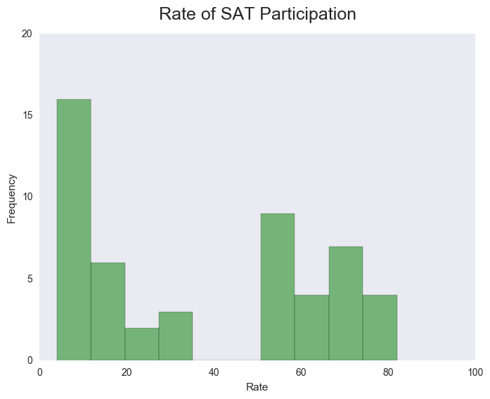
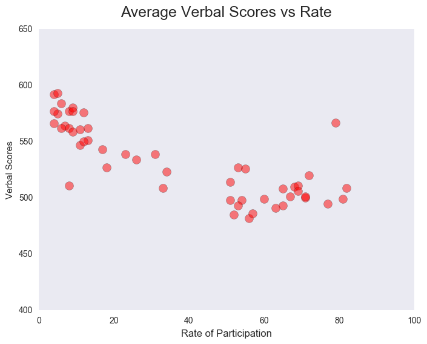
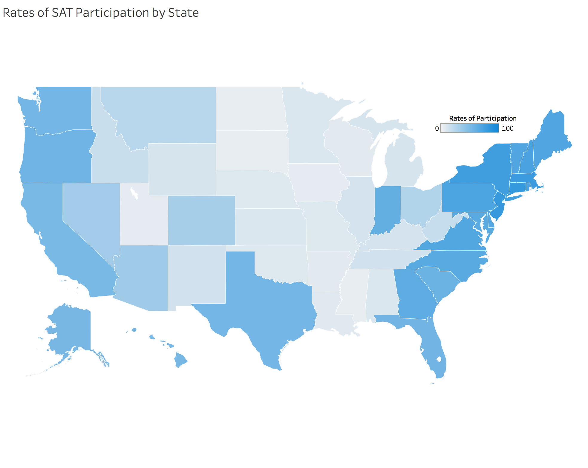
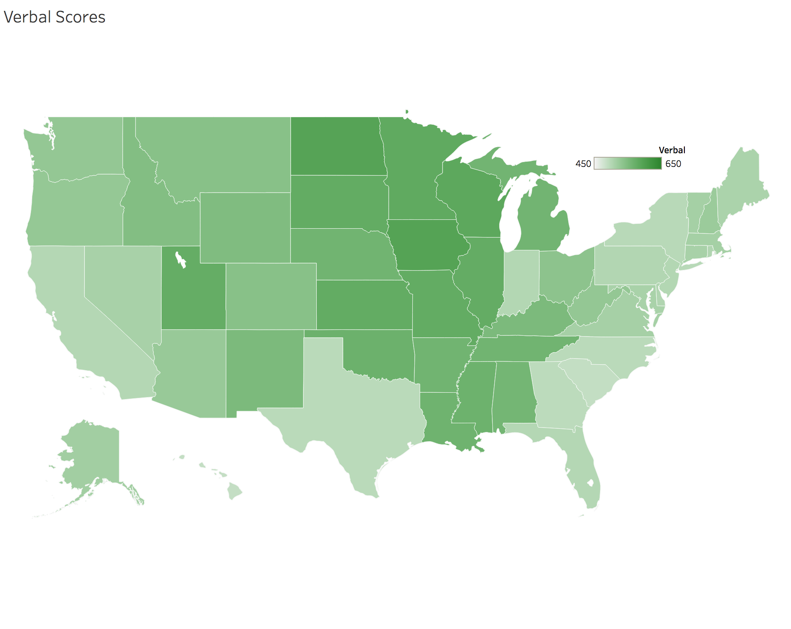
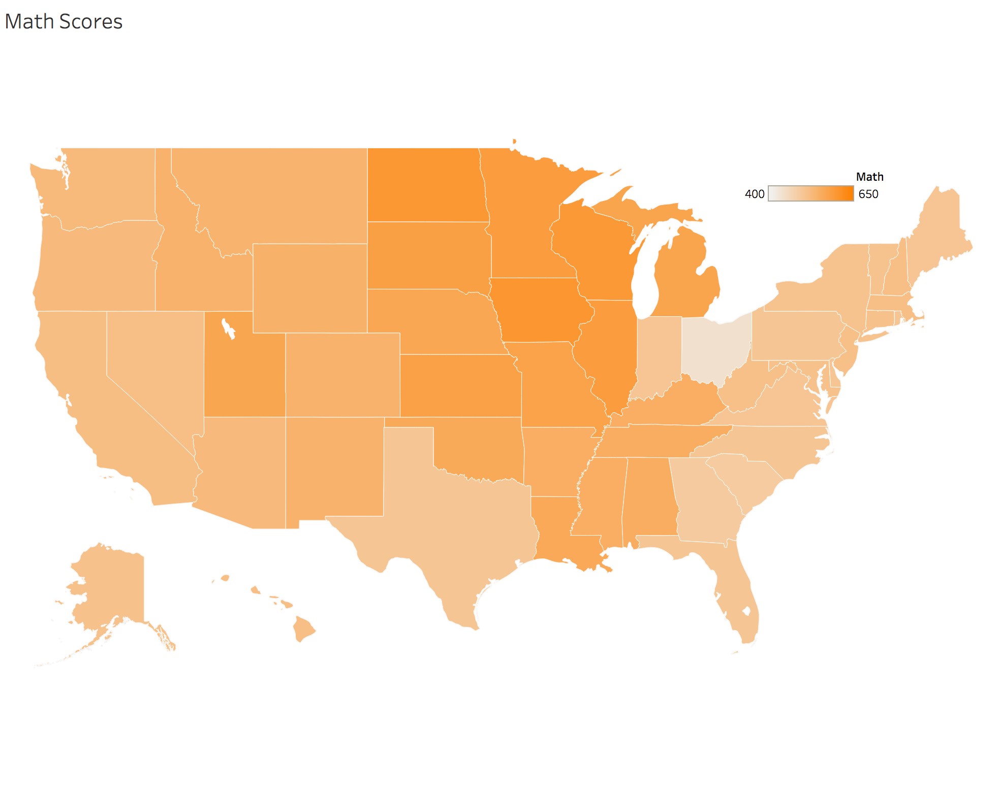

--
layout: post
title: SAT scores around the United States
--

For this project we will be using python with the matplotlib, numpy, and seaborn modules, as well as Tableau to explore data for SAT scores around the United States. We will be looking for any correlations that exist between mean scores and the rate of participation. 

Taking a quick look at the csv we can see we have average verbal and math scores by state - here represented by its abbreviation - as well as the rate of participation in the SAT for each state and the District of Columbia for the year 2001. Additionally, there is a row giving the mean scores and rate for all states that will need to be removed.

First we want to import our libraries and set our charts to plot inline.

```python
# Numeric and statistics packages:
import numpy as np
import scipy.stats as stats

import csv

# Pandas handles dataset loading and manipulation:
import pandas as pd

# import the plotting functions:
import matplotlib.pyplot as plt
import seaborn as sns

# Setup matplotlib to display in notebook:
%matplotlib inline
```

## Reading in the Data

I’ve used both the python csv module and the pandas library to read in the data and demonstrate the differences between each.

We can see that using pandas reads in a nicely organized dataframe with the headers recognized already. 

```python

#Read in csv file with pandas
scores_pd = pd.read_csv('/Users/anthonysullivan/Sites/GA-DSI/projects/project-1-sat-scores/assets/sat_scores.csv')

```

When we read in with the csv module the data needs to be split into a list of lists

```python
# Read in data using csv module and create list of lists
sat_scores_path = '/Users/anthonysullivan/Sites/GA-DSI/projects/project-1-sat-scores/assets/sat_scores.csv'

rows_csv = []

with open(sat_scores_path, 'r') as f:
    reader = csv.reader(f)
    for row in reader:
        rows_csv.append(row)

```

On our list, we need to remove the header. We also need to remove the row 'All', which is a mean of all states, from both our list and our dataframe. 

```python
# Extract list of labels and remove them from data
header = rows_csv[0]
data = rows_csv[1:]
``` 

```python
# Remove 'ALL' row from data
length = len(data)
data = data[0:length - 1]
print data[0:5]

# Remove 'ALL' row from Dataframe
scores_pd = scores_pd[scores_pd.State != 'All']
scores_pd.describe()
```
By checking the data types of each column on our list, we can see the data has been read in as strings. We will need to reassign the values for Rate, Verbal, and Math to integers. We can then create a dictionary of these values mapped to each state in order to call operations on it later.

```python
# Replace the Rate, Verbal, and Math strings with integers
numerical_data = [[line[0], int(line[1]), int(line[2]), int(line[3])] for line in data]
print(numerical_data[0:5])

#Create a dictionary using the State column for keys and using the rate, verbal, and math columns to create a list\
#for the values
stateData = {item[0]: [item[1], item[2], item[3]] for item in numerical_data}
print stateData.items()[0:5
```
## Describing the Data

By calling dtypes on the dataframe, we can see that pandas auto recognizes the type of each column.

```python
#Print the types of each column in the dataframe
scores_pd.dtypes
```

    State     object
    Rate       int64
    Verbal     int64
    Math       int64
    dtype: object

Using pandas to describe our dataframe we can see the max and min values for each column, the mean, and standard deviation.

```python
scores_pd.describe()
```

On our dictionary, we can use list comprehensions to get the max and min values of our data. We can then use a function or Numpy to get the standard deviation.

## Exploratory Data Analysis

I’ve used matplotlib.pyplot to plot the histograms of each column from our dictionary.

```python
# Set the plot size
fig, ax = plt.subplots(figsize=(8,6))

# Plot the histogram for Math with matplotlib.pyplot
plt.hist(Math, bins=10, alpha=0.5)
plt.xlabel('Math Scores')
plt.ylabel('Frequency')
plt.title('Average Math Scores per State', fontsize=18, y=1.03)
plt.axis([400, 650, 0, 14])

# Plot the histogram for math with pandas overlaid
scores_pd['Math'].hist(bins=10, alpha=0.5)
plt.grid(False)
plt.show()
```



Here we can see the wide variance in rates of participation between states with a gap in the middle. This leads me to question the policies towards testing in each state and whether those policies have a strong correlation with participation rates.



Using matplotlib.pyplot to plot the scatter plots of each score category against the rate of participation, we can see that states with much lower participation rates have a significantly higher mean score for both verbal and math subjects. This would suggest that the smaller population taking the SAT in these states possibly tends to be students that are more ambitious and more prepared. 

Using Tableau to create a few choropleths of our data we can see that the coasts have much higher rates of participation than the middle of the country. Variations in local policies and college admission policies will probably show some correlation here, with the major academic corridors along the coasts. We can also see, with the exceptions of Connecticut and Ohio, that states with higher participation rates tend to have lower mean SAT scores.







 The gap in participation rates and the multimodal distribution of the test scores would suggest state policies and competition from the ACT is tainting the results of SAT scores across the country. SAT scores on their own would not be a good measure of student aptitude across the country. See these maps from the NYTimes. Link to ACT/SAT maps.

Link to the jupyter notebook: 


