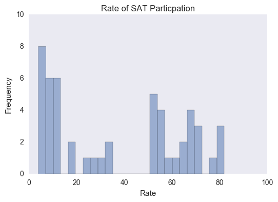
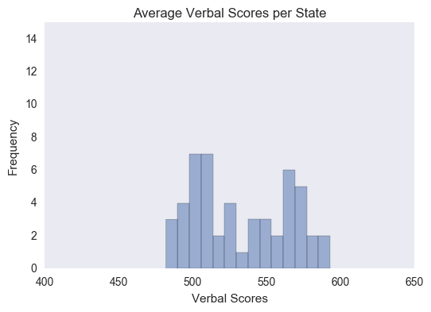
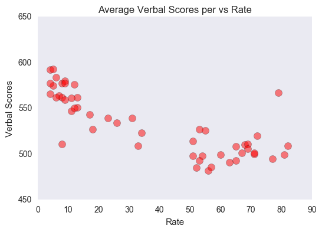
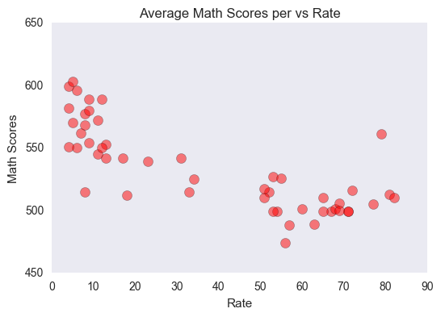
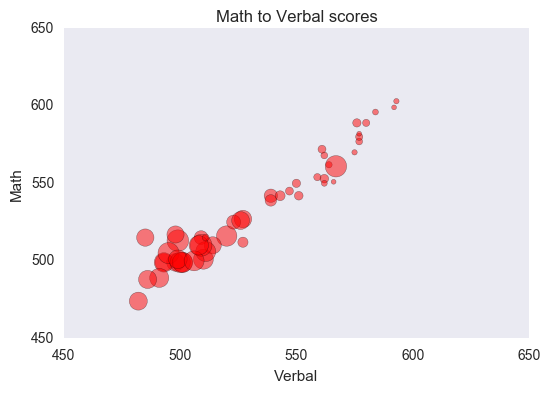
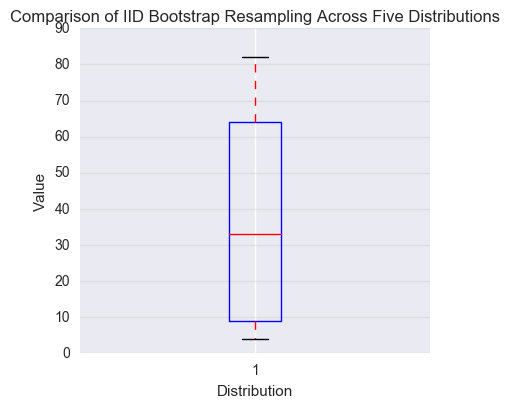
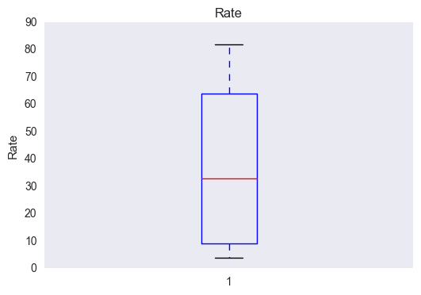

--
layout: post
title: SAT scores around the United States
--

For this project we will be using python with the matplotlib, numpy, and seaborn modules, as well as Tableau to explore data for SAT scores around the United States. We will be looking for any correlations that exist between mean scores and the rate of participation. First we import our libraries and set our charts to plot inline.

```python
# Numeric and statistics packages:
import numpy as np
import scipy.stats as stats

import csv

# Pandas handles dataset loading and manipulation:
import pandas as pd

# import the plotting functions:
import matplotlib.pyplot as plt
import seaborn as sns

# Setup matplotlib to display in notebook:
%matplotlib inline
```

Taking a quick look at the csv we can see we have average verbal and math scores by state - here represented by its abbreviation - as well as the rate of participation in the SAT for each state and the District of Columbia for the year 2001. Additionally, there is a row giving the mean scores and rate for all states that will need to be removed.


## Reading in the Data

I’ve used both the python csv module and the pandas library to read in the data and demonstrate the differences between each.

We can see that using pandas reads in a nicely organized dataframe with the headers recognized already. 

```python

#Read in csv file with pandas
scores_pd = pd.read_csv('/Users/anthonysullivan/Sites/GA-DSI/projects/project-1-sat-scores/assets/sat_scores.csv')

#Open and read in csv file with base python
f = open('/Users/anthonysullivan/Sites/GA-DSI/projects/project-1-sat-scores/assets/sat_scores.csv', 'r')
data = f.read()

```

When we read in with the csv module the data needs to be split into a list of lists

```python
# Read in data using csv module and create list of lists
sat_scores_path = '/Users/anthonysullivan/Sites/GA-DSI/projects/project-1-sat-scores/assets/sat_scores.csv'

rows_csv = []

with open(sat_scores_path, 'r') as f:
    reader = csv.reader(f)
    for row in reader:
        rows_csv.append(row)

```

## Describing the Data

By calling dtypes on the dataframe, we can see that pandas auto recognizes the type of each column.

Using pandas to describe our dataframe we can see the max and min values for each column, the mean, and standard deviation.


The header removed. Additionally, by printing the type of each column we can see the data has been read in as strings, so we will need to reassign the values for Rate, Verbal, and Math to integers. We can then create a dictionary of these values mapped to each state in order to call operations on it later.


On our dictionary, we can use list comprehensions to get the max and min values of our data. We can then use a function or Numpy to get the standard deviation.


## Exploratory Data Analysis

I’ve used matplotlib.pyplot to plot the histograms of each column from our dictionary.

Here we can see the wide variance in rates of participation between states with a gap in the middle. This leads me to question the policies towards testing in each state and whether those policies have a strong correlation with participation rates.

Now using matplotlib.pyplot to plot the scatter plots of each score category against the rate of participation we can see that states with much lower participation rates have a significantly higher mean score for both verbal and math subjects. This would suggest that the smaller population taking the SAT in these states possibly tends to be students that are more ambitious and more prepared. 

Using Tableau to create a few choropleths of our data we can see that the coasts have much higher rates of participation than the middle of the country. Variations in local policies and college admission policies will probably show some correlation here, with the major academic corridors along the coasts. We can also see, with the exceptions of Connecticut and Ohio, that states with higher participation rates tend to have lower mean SAT scores.

 The gap in participation rates and the multimodal distribution of the test scores would suggest state policies and competition from the ACT is tainting the results of SAT scores across the country. SAT scores on their own would not be a good measure of student aptitude across the country. See these maps from the NYTimes. Link to ACT/SAT maps.

Link to the jupyter notebook

## Step 2: Load the data.


```python
# Numeric and statistics packages:
import numpy as np
import scipy.stats as stats

import csv

# Pandas handles dataset loading and manipulation:
import pandas as pd

# import the plotting functions:
import matplotlib.pyplot as plt
import seaborn as sns

# Setup matplotlib to display in notebook:
%matplotlib inline

#Read in csv file with pandas
scores_pd = pd.read_csv('/Users/anthonysullivan/Sites/GA-DSI/projects/project-1-sat-scores/assets/sat_scores.csv')

# Read in data using csv module and create list of lists
sat_scores_path = '/Users/anthonysullivan/Sites/GA-DSI/projects/project-1-sat-scores/assets/sat_scores.csv'

rows_csv = []

with open(sat_scores_path, 'r') as f:
    reader = csv.reader(f)
    for row in reader:
        rows_csv.append(row)
```


##### 6. Extract a list of the labels from the data, and remove them from the data.


```python
# Extract list of labels and remove them from data
header = rows_csv[0]
data = rows_csv[1:]

print header

# Remove 'ALL' row from data
length = len(data)
data = data[0:length - 1]
print data[0:5]

# Remove 'ALL' row from Dataframe
scores_pd = scores_pd[scores_pd.State != 'All']
scores_pd.describe()

# Alternate method for removing last row of dataframe, 'All'
# print len(scores_pd)
# scores_pd = scores_pd.drop(scores_pd.index[[len(scores_pd)-1,]])
```

    ['State', 'Rate', 'Verbal', 'Math']
    [['CT', '82', '509', '510'], ['NJ', '81', '499', '513'], ['MA', '79', '511', '515'], ['NY', '77', '495', '505'], ['NH', '72', '520', '516']]


<div>
<table border="1" class="dataframe">
  <thead>
    <tr style="text-align: right;">
      <th></th>
      <th>Rate</th>
      <th>Verbal</th>
      <th>Math</th>
    </tr>
  </thead>
  <tbody>
    <tr>
      <th>count</th>
      <td>51.000000</td>
      <td>51.000000</td>
      <td>51.000000</td>
    </tr>
    <tr>
      <th>mean</th>
      <td>37.000000</td>
      <td>532.529412</td>
      <td>531.843137</td>
    </tr>
    <tr>
      <th>std</th>
      <td>27.550681</td>
      <td>33.360667</td>
      <td>36.287393</td>
    </tr>
    <tr>
      <th>min</th>
      <td>4.000000</td>
      <td>482.000000</td>
      <td>439.000000</td>
    </tr>
    <tr>
      <th>25%</th>
      <td>9.000000</td>
      <td>501.000000</td>
      <td>503.000000</td>
    </tr>
    <tr>
      <th>50%</th>
      <td>33.000000</td>
      <td>527.000000</td>
      <td>525.000000</td>
    </tr>
    <tr>
      <th>75%</th>
      <td>64.000000</td>
      <td>562.000000</td>
      <td>557.500000</td>
    </tr>
    <tr>
      <th>max</th>
      <td>82.000000</td>
      <td>593.000000</td>
      <td>603.000000</td>
    </tr>
  </tbody>
</table>
</div>


##### 7. Create a list of State names extracted from the data. (Hint: use the list of labels to index on the State column)


```python
# Extract the State names as variable states
states = [lists[header.index('State')] for lists in data]
print states
print '-'

# Extract State names from pd.dataframe
states_pd = scores_pd.State.values
states_pd.to_frame()
```

    ['CT', 'NJ', 'MA', 'NY', 'NH', 'RI', 'PA', 'VT', 'ME', 'VA', 'DE', 'MD', 'NC', 'GA', 'IN', 'SC', 'DC', 'OR', 'FL', 'WA', 'TX', 'HI', 'AK', 'CA', 'AZ', 'NV', 'CO', 'OH', 'MT', 'WV', 'ID', 'TN', 'NM', 'IL', 'KY', 'WY', 'MI', 'MN', 'KS', 'AL', 'NE', 'OK', 'MO', 'LA', 'WI', 'AR', 'UT', 'IA', 'SD', 'ND', 'MS']
    -


    array(['CT', 'NJ', 'MA', 'NY', 'NH', 'RI', 'PA', 'VT', 'ME', 'VA', 'DE',
           'MD', 'NC', 'GA', 'IN', 'SC', 'DC', 'OR', 'FL', 'WA', 'TX', 'HI',
           'AK', 'CA', 'AZ', 'NV', 'CO', 'OH', 'MT', 'WV', 'ID', 'TN', 'NM',
           'IL', 'KY', 'WY', 'MI', 'MN', 'KS', 'AL', 'NE', 'OK', 'MO', 'LA',
           'WI', 'AR', 'UT', 'IA', 'SD', 'ND', 'MS'], dtype=object)


##### 8. Print the types of each column


```python
#Print the type of each column in data
print 'Lists'
print 'State', type([lists[header.index('State')] for lists in data][0])
print 'Rate', type([lists[header.index('Rate')] for lists in data][0])
print 'Verbal', type([lists[header.index('Verbal')] for lists in data][0])
print 'Math', type([lists[header.index('Math')] for lists in data][0])

print '-'

#Print the types of each column in the dataframe
print 'Dataframe'
scores_pd.dtypes
```

    Lists
    State <type 'str'>
    Rate <type 'str'>
    Verbal <type 'str'>
    Math <type 'str'>
    -
    Dataframe


    State     object
    Rate       int64
    Verbal     int64
    Math       int64
    dtype: object


##### 9. Do any types need to be reassigned? If so, go ahead and do it.


```python
# Replace the Rate, Verbal, and Math strings with integers
numerical_data = [[line[0], int(line[1]), int(line[2]), int(line[3])] for line in data]
print(numerical_data[0:5])
```

    [['CT', 82, 509, 510], ['NJ', 81, 499, 513], ['MA', 79, 511, 515], ['NY', 77, 495, 505], ['NH', 72, 520, 516]]


##### 10. Create a dictionary for each column mapping the State to its respective value for that column. 


```python
# Create a dictionary setting the State column to keys and rate column to values
stateRate = {}
for item in numerical_data:
    stateRate.update({item[0]: item[1]})
print 'Rate Dictionary'
print stateRate
print '-'

# Create a dictionary setting the State column to keys and Verbal column to values
stateVerbal = {item[0]: item[2] for item in numerical_data}
print 'Verbal Dictionary'
print stateVerbal
print '-'

# Create a dictionary setting the State column to keys and Math column to values
stateMath = {item[0]: item[3] for item in numerical_data}
print 'Math Dictionary'
print stateMath
```

    Rate Dictionary
    {'WA': 53, 'DE': 67, 'DC': 56, 'WI': 6, 'WV': 18, 'HI': 52, 'FL': 54, 'WY': 11, 'NH': 72, 'NJ': 81, 'NM': 13, 'TX': 53, 'LA': 7, 'NC': 65, 'ND': 4, 'NE': 8, 'TN': 13, 'NY': 77, 'PA': 71, 'RI': 71, 'NV': 33, 'VA': 68, 'CO': 31, 'AK': 51, 'AL': 9, 'AR': 6, 'VT': 69, 'IL': 12, 'GA': 63, 'IN': 60, 'IA': 5, 'MA': 79, 'AZ': 34, 'CA': 51, 'ID': 17, 'CT': 82, 'ME': 69, 'MD': 65, 'OK': 8, 'OH': 26, 'UT': 5, 'MO': 8, 'MN': 9, 'MI': 11, 'KS': 9, 'MT': 23, 'MS': 4, 'SC': 57, 'KY': 12, 'OR': 55, 'SD': 4}
    -
    Verbal Dictionary
    {'WA': 527, 'DE': 501, 'DC': 482, 'WI': 584, 'WV': 527, 'HI': 485, 'FL': 498, 'WY': 547, 'NH': 520, 'NJ': 499, 'NM': 551, 'TX': 493, 'LA': 564, 'NC': 493, 'ND': 592, 'NE': 562, 'TN': 562, 'NY': 495, 'PA': 500, 'RI': 501, 'NV': 509, 'VA': 510, 'CO': 539, 'AK': 514, 'AL': 559, 'AR': 562, 'VT': 511, 'IL': 576, 'GA': 491, 'IN': 499, 'IA': 593, 'OK': 567, 'AZ': 523, 'CA': 498, 'ID': 543, 'CT': 509, 'ME': 506, 'MD': 508, 'MA': 511, 'OH': 534, 'UT': 575, 'MO': 577, 'MN': 580, 'MI': 561, 'KS': 577, 'MT': 539, 'MS': 566, 'SC': 486, 'KY': 550, 'OR': 526, 'SD': 577}
    -
    Math Dictionary
    {'WA': 527, 'DE': 499, 'DC': 474, 'WI': 596, 'WV': 512, 'HI': 515, 'FL': 499, 'WY': 545, 'NH': 516, 'NJ': 513, 'NM': 542, 'TX': 499, 'LA': 562, 'NC': 499, 'ND': 599, 'NE': 568, 'TN': 553, 'NY': 505, 'PA': 499, 'RI': 499, 'NV': 515, 'VA': 501, 'CO': 542, 'AK': 510, 'AL': 554, 'AR': 550, 'VT': 506, 'IL': 589, 'GA': 489, 'IN': 501, 'IA': 603, 'OK': 561, 'AZ': 525, 'CA': 517, 'ID': 542, 'CT': 510, 'ME': 500, 'MD': 510, 'MA': 515, 'OH': 439, 'UT': 570, 'MO': 577, 'MN': 589, 'MI': 572, 'KS': 580, 'MT': 539, 'MS': 551, 'SC': 488, 'KY': 550, 'OR': 526, 'SD': 582}


##### 11. Create a dictionary with the values for each of the numeric columns


```python
#Create a dictionary using the State column for keys and using the rate, verbal, and math columns to create a list\
#for the values
stateData = {item[0]: [item[1], item[2], item[3]] for item in numerical_data}
print stateData.items()[0:5
```

    [('WA', [53, 527, 527]), ('DE', [67, 501, 499]), ('DC', [56, 482, 474]), ('WI', [6, 584, 596]), ('WV', [18, 527, 512])]


## Step 3: Describe the data

##### 12. Print the min and max of each column


```python
# Print the min and max values for each column and their corresponding key
print 'Dictionary'
print '-'
min_rate = min(stateRate.itervalues())
minRateState = [k for k, v in stateRate.iteritems() if v == min_rate]
print 'Minimum Rate: ', minRateState, min_rate
print '-'

max_rate = max(stateRate.itervalues())
maxRateState = [k for k, v in stateRate.iteritems() if v == max_rate]
print 'Maximum Rate: ', maxRateState, max_rate
print '-'

min_verbal = min(stateVerbal.itervalues())
minVerbalStates = [k for k, v in stateVerbal.iteritems() if v == min_verbal]
print 'Lowest Verbal Score: ', minVerbalStates, min_verbal
print '-'

max_verbal = max(stateVerbal.itervalues())
maxVerbalStates = [k for k, v in stateVerbal.iteritems() if v == max_verbal]
print 'Highest Verbal Score: ', maxVerbalStates, max_verbal
print '-'

min_math = min(stateMath.itervalues())
minMathStates = [k for k, v in stateMath.iteritems() if v == min_math]
print 'Lowest Math Score: ', minMathStates, min_math
print '-'

max_math = max(stateMath.itervalues())
maxMathStates = [k for k, v in stateMath.iteritems() if v == max_math]
print 'Highest Math Score: ', maxMathStates, max_math
print'-'

#Find min and max values for each column in the pd.Dataframe
print 'Dataframe'
print '-'
minRate = scores_pd.Rate.values.min()
minRateIndex = scores_pd.loc[scores_pd['Rate'].idxmin()]
maxRateState = scores_pd.State.iloc[minRateIndex.name]
print 'Minimum Rate: ', minRate, maxRateState
print '-'

maxRate = scores_pd.Rate.values.max()
maxRateIndex = scores_pd.loc[scores_pd['Rate'].idxmax()]
maxRateState = scores_pd.State.iloc[maxRateIndex.name]
print 'Maximum Rate: ', maxRate, maxRateState
print '-'

minVerbal = scores_pd.Verbal.values.min()
minVerbalState = scores_pd.State.iloc[scores_pd.loc[scores_pd['Verbal'].idxmin()].name]
print 'Lowest Verbal Score: ', minVerbal, minVerbalState
print '-'

maxVerbal = scores_pd.Verbal.values.max()
maxVerbalIndex = scores_pd.loc[scores_pd['Verbal'].idxmax()]
maxVerbalState = scores_pd.State.iloc[scores_pd.loc[scores_pd['Verbal'].idxmax()].name]
print 'Highest Verbal Score: ', maxVerbal, maxVerbalState 
print '-'

minMath = scores_pd.Math.values.min()
minMathState = scores_pd.State.iloc[scores_pd.loc[scores_pd['Math'].idxmin()].name]
print 'Lowest Math Score: ', minMath, minMathState
print '-'

maxMath = scores_pd.Math.values.max()
maxMathState = scores_pd.State.iloc[scores_pd.loc[scores_pd['Math'].idxmax()].name]
print 'Highest Math Score: ', maxMath, maxMathState
print '-'
```

    Dictionary
    -
    Minimum Rate:  ['ND', 'MS', 'SD'] 4
    -
    Maximum Rate:  ['CT'] 82
    -
    Lowest Verbal Score:  ['DC'] 482
    -
    Highest Verbal Score:  ['IA'] 593
    -
    Lowest Math Score:  ['OH'] 439
    -
    Highest Math Score:  ['IA'] 603
    -
    Dataframe
    -
    Minimum Rate:  4 SD
    -
    Maximum Rate:  82 CT
    -
    Lowest Verbal Score:  482 DC
    -
    Highest Verbal Score:  593 IA
    -
    Lowest Math Score:  439 OH
    -
    Highest Math Score:  603 IA
    -


##### 13. Write a function using only list comprehensions, no loops, to compute Standard Deviation. Print the Standard Deviation of each numeric column.


```python
# Function definition to calculate standard deviation
def stddev(lister):
    variance = (np.sum([(i - np.mean(lister)) ** 2 for i in lister])) / len(lister)   
    std = variance**(1/2.0)
    return 'Std Dev', std, 'Var', variance

# Print the Standard Deviation of each column using the dictionaries created for each
print 'Rate: ', stddev(stateRate.values())
print 'Verbal: ', stddev(stateVerbal.values())
print 'Math: ', stddev(stateMath.values())

# Check the vale produced by the function with numpy
print 'Rate: ', np.std(Rate), 'numpy'
print '-'
                       
# Use numpy to get the standard deviation of each Dataframe column
print 'Dataframe'
print 'Standard Deviation Rate: ', np.std(scores_pd.Rate.values)
print 'Standard Deviation Verbal: ', np.std(scores_pd.Verbal.values)
print 'Standard Deviation Math: ', np.std(scores_pd.Math.values)

```

    Rate:  ('Std Dev', 27.279238676053591, 'Var', 744.15686274509801)
    Verbal:  ('Std Dev', 33.031982684152283, 'Var', 1091.1118800461361)
    Math:  ('Std Dev', 35.929873173114082, 'Var', 1290.955786236063)
    Rate:  27.2792386761 numpy
    -
    Dataframe
    Standard Deviation Rate:  27.2792386761
    Standard Deviation Verbal:  33.0319826842
    Standard Deviation Math:  35.9298731731


## Step 4: Visualize the data

##### 14. Using MatPlotLib and PyPlot, plot the distribution of the Rate using histograms.


```python
# Set the plot size
fig, ax = plt.subplots(figsize=(8,6))

# Plot the histogram for rate with matplotlib.pyplot
plt.hist(Rate, bins=10, facecolor='green', alpha=0.5)
plt.xlabel('Rate')
plt.ylabel('Frequency')
plt.title('Rate of SAT Participation', fontsize=18, y=1.03)
plt.axis([0, 100, 0, 20])
plt.grid(False)
```





##### 15. Plot the Math distribution


```python
# Set the plot size
fig, ax = plt.subplots(figsize=(8,6))

# Plot the histogram for Math with matplotlib.pyplot
plt.hist(Math, bins=10, alpha=0.5)
plt.xlabel('Math Scores')
plt.ylabel('Frequency')
plt.title('Average Math Scores per State', fontsize=18, y=1.03)
plt.axis([400, 650, 0, 14])

# Plot the histogram for math with pandas overlaid
scores_pd['Math'].hist(bins=10, alpha=0.5)
plt.grid(False)
plt.show()
```


##### 16. Plot the Verbal distribution


```python
# Set the plot size
fig, ax = plt.subplots(figsize=(8,6))

# Plot the histogram for Verbal scores with matplotlib.pyplot
plt.hist(Verbal, bins=10, facecolor='orange', alpha=0.75)
plt.xlabel('Verbal Scores')
plt.ylabel('Frequency')
plt.title('Average Verbal Scores per State', fontsize=18, y=1.03)
plt.axis([400, 650, 0, 14])
plt.grid(False)

```





##### 17. What is the typical assumption for data distribution?

That the data has a normal distribution.

##### 18. Does that distribution hold true for our data?

No. Our data shows multimodal distribution.

##### 19. Plot some scatterplots. **BONUS**: Use a PyPlot `figure` to present multiple plots at once.


```python
# Set the plot size
fig, ax = plt.subplots(figsize=(8,6))

# Create a scatter plot of rate vs verbal using matplotlib.pyplot
plt.scatter(Rate,Verbal, s=100, c='red', alpha=.5)
plt.xlabel('Rate of Participation', fontsize=12)
plt.ylabel('Verbal Scores')
plt.title('Average Verbal Scores vs Rate', fontsize=18, y=1.03)
plt.axis([0, 100, 400, 650])
plt.grid(False)
plt.show()

# Create a scatter plot of rate vs Math using matplotlib.pyplot
fig, ax = plt.subplots(figsize=(8,6))
plt.scatter(Rate, Math, s=75, c='red', alpha=.5)
plt.xlabel('Rate of Participation', fontsize=12)
plt.ylabel('Math Scores', fontsize=12)
plt.title('Average Math Scores vs Rate', fontsize=18, y=1.03)
plt.axis([0, 100, 400, 650])
plt.grid(False)
plt.show()

# Create a scatter plot of Verbal vs Math using matplotlib.pyplot setting the size of the bubble to reflect rate
fig, ax = plt.subplots(figsize=(8,6))
area2 = [[item*5] for item in Rate]
plt.scatter(Verbal, Math, s=area2, c='red', alpha=.5)
plt.xlabel('Verbal Scores', fontsize=12)
plt.ylabel('Math Scores', fontsize=12)
plt.title('Math Scores vs Verbal scores', fontsize=18, y=1.03)
plt.axis([400, 650, 400, 650])
plt.grid(False)
plt.show()
```











##### 20. Are there any interesting relationships to note?

States with low rates of participation tend to have a higher average score on both the verbal and math sections of the SAT.  
States on the coasts have higher rates of participation. To get a better understanding of this, I would want to look at college matriculation rates and ACT participation rates for each state as well and compare that to SAT data. Also, I want to look at State testing policies for highschool students.

##### 21. Create box plots for each variable. 


```python
# Set the size and margin
fig, ax1 = plt.subplots(figsize=(4, 5))
fig.canvas.set_window_title('Rate')
plt.subplots_adjust(left=0.075, right=0.95, top=0.9, bottom=0.25)

# Create of Box plot of the Rate
plt.boxplot(Rate, notch=True, patch_artist=True)
plt.ylabel('Rate')
plt.title('Rate', fontsize = 16, y=1.01)
plt.grid(True, linestyle='-', which='major', color='lightgrey')
#plt.patch.set_facecolor(color)
plt.show()

# Set the size and margin
fig, ax1 = plt.subplots(figsize=(4, 5))
fig.canvas.set_window_title('Rate')
plt.subplots_adjust(left=0.075, right=0.95, top=0.9, bottom=0.25)

# Plot Verbal and Math scores side by side
score_plots = [Verbal, Math]
box = plt.boxplot(score_plots, notch=True, patch_artist=True)
plt.ylabel('Score')
plt.title('Scores', fontsize = 16, y=1.01)
plt.grid(True, linestyle='-', which='major', color='lightgrey', alpha=0.5)
colors = ['green', 'orange']
for patch, color in zip(box['boxes'], colors):
    patch.set_facecolor(color)
    
plt.show()

```








##### BONUS: Using Tableau, create a heat map for each variable using a map of the US. 


```python
#


```

    /bin/sh: -c: line 0: syntax error near unexpected token `./assets/img/RateofParticipation.png'
    /bin/sh: -c: line 0: `[](./assets/img/RateofParticipation.png)'


```python
# Import Seaborn and set style
import seaborn as sns
sns.set(color_codes=True)
sns.set_style('dark')

```


```python
# Plot histogram for rate
sns.distplot(Rate)
plt.title("Rates of Participation", fontname='Ubuntu', fontsize=14, fontstyle='italic', fontweight='bold')
plt.show()
```


```python
# Plot histogram for math and verbal
sns.distplot(Math)
plt.title("Math Scores", fontname='Ubuntu', fontsize=14, fontstyle='italic', fontweight='bold')
plt.show()
sns.distplot(Verbal)
plt.title("Verbal Scores", fontname='Ubuntu', fontsize=14, fontstyle='italic', fontweight='bold')
plt.show()

```


```python

```
