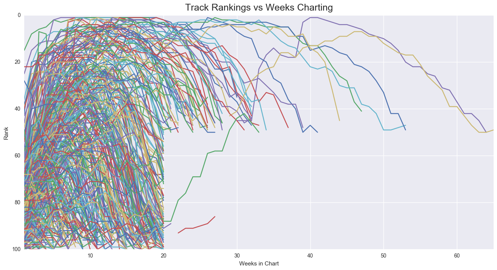
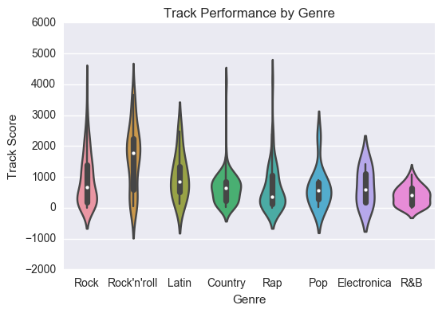

This week we are looking at data from the Billboard Hot 100 of 2000.
Our dataset represents the top performing tracks for the year 2000 based on Billboard's metrics. It includes all of the tracks that peaked during the year 2000. Using Billboard chart data to analyze we can look for any indicators for what made a song do well in the charts and if certain genres performed well.

### Lets take a look at our dataset

Lets look at how Billboard compiles its Hot 100 list since many of our assumptions will be due to Billboard's own <a href="https://en.wikipedia.org/wiki/Billboard_Hot_100#Year-end_charts">metrics</a>.

"Chart rankings are based on sales (physical and digital), radio play and online streaming."

Also interesting to note is the way in which Billboard charts by genre, which is done by tracking audiences rather than grouping tracks by their recognized genre: 

“What separates the charts is which stations and stores are used; each musical genre has a core audience or retail group. Each genre's department at Billboard is headed up by a chart manager, who makes these determinations.”

In this excercise we will assume that the Billboard's metrics for measuring tracks popularity are a good good measure of track performance. 

We are also assuming the labelling of our data is correct. Genre is a contentious issue, but since Billboard is our client in this case, we will trust their judgement here. (The data is mislabelled, but for the purposes of this project we will assume it is correct.)

Because Billboard determines genre rankings by tracking the expected audience rather than basing the genre on song characteristics, many songs crossover into multiple genre charts. For instance, a song may chart in the R&B chart as well as the Pop chart if it is popular in the metrics for both audiences. We will use this to relabel tracks that fall into genres representing less than 1% of our data.

Another problem of tracking genre by audience that it assumes that a particular audience’s taste is static. Though an audience may favor one genre over another, many will enjoy a great track no matter the genre to some degree (country being a bit more difficult perhaps).
For this reason, as well as the mislabelled genres of many songs I will avoid using genre for any analysis.

Some of our risks: 

- The data set is not very large and only contains data for one year. It would be difficult to maintain any correlations found here over further years. 

- Because we are not privy to Billboard's metrics and our data is one step  removed, it does not contain the level fineness used in ranking songs in the Hot 100. Therefore a song reaching the number one spot for three weeks in May may not have done as well as a song reaching the top spot for three weeks in June based on the underlying metrics, but we will have to treat them as equal here.

### Exploring the data / Munging

The data set need quite a bit of reformatting. Null values were set using np.nan. Empty week columns were dropped, as was the column for year as all tracks are from 2000. Categorical series were checked for duplicates. The genre categories were relabelled to correct some duplicates and to group tracks from lesser represented genres into broader genres. The logic for this is that many songs - especially from underrepresented genres - can be considered crossover songs, charting in multiple genre categories. The track length - 'time' - was reformatted from 'mm.ss.ms AM' into seconds. Additionally, to be able to calculate the number of weeks it took a song to peak, the date for entry into the chart and the date for peaking were both reformatted from a string in the format 'Month Day, Year' into a Datetime format. The top ranking and number of weeks a track was in the charts were also pulled out of the data, and a song score was computed by summing the inverse rank over all weeks a song charted.

Some interesting quirks arose while exploring the data. Most racks in the Hot 100 fell of the charts after week 20. All of these tracks were ranked below the top 50 when they exited. Additionally, tracks that remained in the charts beyond 20 weeks all exited the chart in the top 50. This leads me to speculate that
There are some quirks in either the music industry or in the methods Billboatd uses to rank songs. For instance, this could represent the prevalence of top 40 radio airplay and Billboards us of airplay in their ranking methods. There could be a 20 week airplay rotation for songs that aren't in the top 40, with only those in the top 40 remaining in the charts beyond week 20. This could represent an over reliance on airplay in determining track popularity. 

If we take a look at the genres we can see that rock songs are the most numerous in the charts in 2000. Rock’n’roll tracks appear to have outperformed other genres based on song score.

Rock’n’roll songs demonstrate a median song score of over 1600. That is almost 1200 points better than the median song score for all tracks. 

This leads us to our first problem statement. 

- Do certain genres perform better than others

To determine if the median score difference for Rock’n’roll songs is significant we will use the shuffle method. Using this method we find the probability that a median score difference of 1185 is zero, therefore showing that Rock'n'roll tracks did indeed outperform all other genres.

Interestingly the top performing song of all of 2000 - Faith Hill’s Breathe - never reached the number spot. It made it to number 2 but had long legs, staying in the charts for over 50 weeks. Timing in relation to other hit songs appears to have a strong influence on peak position, but not on overall performance. A short lived hit can keep a popular song with legs from reaching the top spot. 

<a href="https://git.generalassemb.ly/anthonysull/project-2-billboard/blob/master/Billboard100.ipynb">Link</a> to the jupyter notebook. 

