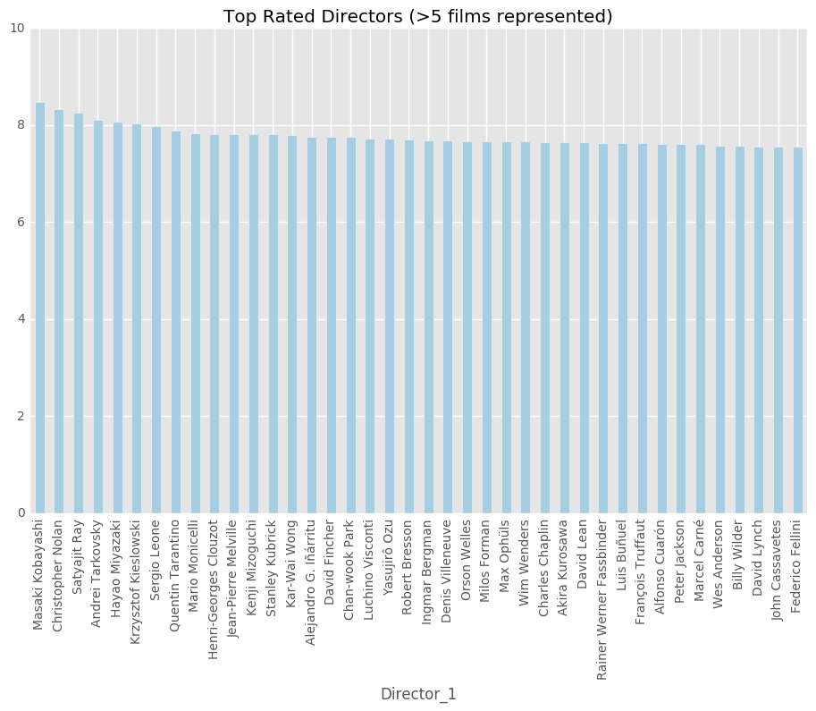

<a href="https://git.generalassemb.ly/anthonysull/project-6-apis-randomforests/blob/master/Project-6_IMDB-titles_2.ipynb">notebook</a>

### Introduction

This week, we will be looking into film ratings for a service like Netflix to better choose which films to provide. We want to pick out some of the factors that lead to a high rating on IMDB. We are going to use ensembled and boosted tree models to build our predictor.

### Data
We are utilizing the OMDb API to grab most of our data and supplementing that with a bit of scraping from the IMDb website using requests and BeautifulSoup.

We grabbed a list of the top 250 movies overall as well as the most popular movies for each year from 1910. We ended up with just under 15,000 titles that included an imdb rating. We included info on the director, producer, production company, writers, cast, genre, a plot summary, box office, imdb rating, metascore, awards, language, runtime, and release date.

We used nlp to pull out features from list of cast and crew

### EDA

### Models:

<a href="https://git.generalassemb.ly/anthonysull/project-6-apis-randomforests/blob/master/Project-6_IMDB-titles_2.ipynb">Link</a> to the jupyter notebook. 

