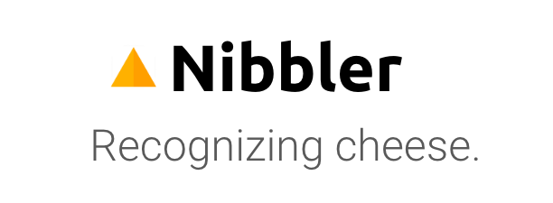
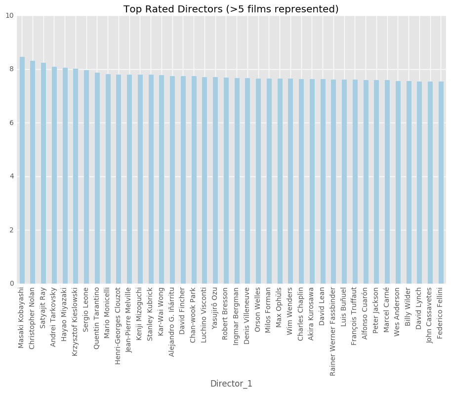
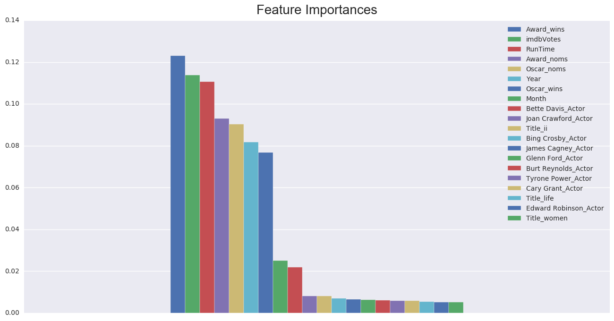

> "How can you govern a country which has two hundred and forty-six varieties of cheese?" French President Charles de Gaulle, 1962

 

For my capstone, I trained a deep learning visual recognition model to identify types of cheese and pitched it as an app named Nibbler.

I used Python with Requests, Selenium, and BeautifulSoup to scrape images of cheese to first build a database. I then used Tensorflow and Google's Inception model, to train a cheese classifier on the images I collected.

Building a library of cheese images was very ambitious, but in the end I was able to achieve a 75% first guess accuracy on a model trained to recognize 30 types of French cheese plus Humboldt Fog - because it is a personal favorite. 

 

> Nibbler is both a reference to trying an array of new cheeses and to the method in which a convolutional neural network extracts features from an image - by convolving a filter, or kernel, over the decoded image array.

 

The project allowed me to combine an interests in computer vision, deep learning, and cheese. I was interested in the ability of machine vision to provide quick access to information, and to see how useful machine vision could be when applied to a task that seemed might be quite difficult, cheese classification. In addition, I was very interested in getting a little bit of experience with TensorFlow. 

 

My approach was to 
 

- Build an image library of cheese.
- Train a deep learning model to recognize different types of cheese.
- Build an app that implements the model. (future work)

## Image Library

To start, I had to decide which types of cheese to include in my classifier - not as easy as it may seem. ImageNet included 33 classes of cheese in its database, but they did not seem to be rigorously chosen - Velveeta, processed cheese, and block cheese as examples. I thought it would be best to focus on artisanal cheeses, as it didn’t make much sense to try and classify well known brands. 

I had hoped to classify a large number of cheeses, but finding enough images for types that are not widely known quickly became an issue. With there considered to be over 350 types of French cheese and a similar number of Italian types, I had to find a way to make my project a bit more manageable. In the end, I settled on trying to classify French cheeses with a protected designation of origin.

### Web Scraping Notebooks

<a href="https://git.generalassemb.ly/anthonysull/project-6-apis-randomforests/blob/master/Project-6_IMDB-titles_2.ipynb">Notebook</a> for scraping from Google Images search results. 
<a href="https://git.generalassemb.ly/anthonysull/project-6-apis-randomforests/blob/master/Project-6_IMDB-titles_2.ipynb">Notebook</a> for scraping from iStock Photos.

### Library Verification

After the initial effort of gathering images, several issues became apparent. The image searches often returned various types of cheese in a single search, diluting the integrity of each sample. There were also many images for locations, events, or dishes that turned up in each search. I decided to train a pre-classifier to sort through the initial image collection. I manually selected a small number of images to create a good library to train a model to weed out images that were not cheese. After sorting and verifying the library, I ended up with 30 types for which I was able to collect enough images to train a model.

## Using TensorFlow and Google’s Inception model for image recognition

Today, the state of the art in image recognition are deep learning convolutional neural networks and a variation of them known as residual networks. Google has made a lot of progress in the last few years with their Inception models, which have been implemented in TensorFlow, Google’s open source machine learning library. I will be using the Inception-v3 model, as it should train a bit faster and still produce similar results.

### Technique: Transfer Learning 

Because training a CNN for image classification from scratch can take a week or more on a decent computer, as a first step I will be using a process called transfer learning. 

“Modern object recognition models have millions of parameters and can take weeks to fully train. Transfer learning is a technique that shortcuts a lot of this work by taking a fully-trained model for a set of categories like ImageNet, and retrains from the existing weights for new classes.” 

Using the pretrained version of Inception, transfer learning allows me to quickly train a model to sort through the images collected during the web scraping stage. I can use this initial model to sort through the library and iterative build up a more complete and accurate training set with which to train a final model to classify types of cheese.

### Training

Training Graph

Classifications

What was classified correctly vs incorrectly

## Conclusion

Achieving an accuracy of 75% was pretty surprising given how similar many types of cheese are to each other - Brie and Camembert for example, or Gruyere and Comte. Deciding to try and build an image library of cheese types was very ambitious and took up most of my time during the project. Many limitations arose during this process. Besides those mentioned earlier, many of the cheese images that turn up in image searches tend to be marketing images and are very similar to each other. Ideally, a library would be built up by producing the photos for each type of cheese and possibly teaming up with cheesemongers. It could also be possible to utilize user engagement with an app, once deployed, to increase the libary. I would also like to train a model from scratch to see how much improvement in accuracy can be achieved. 

### Resources:

<a href="https://www.tensorflow.org/tutorials/image_retraining">How to Retrain Inception's Final Layer for New Categories</a> 
<a href="https://github.com/tensorflow/models/tree/master/inception#how-to-fine-tune-a-pre-trained-model-on-a-new-task">How to Fine-Tune a Pre-Trained Model on a New Task</a>

