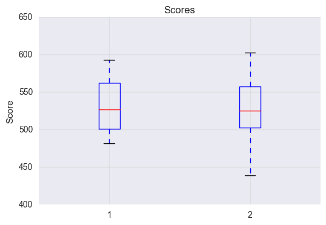

--
layout: post
title: Project 1
--
# Project 1

## Step 1: Open the `sat_scores.csv` file. Investigate the data, and answer the questions below.


##### 1. What does the data describe?

The data describes for each state: the rate that students take the SAT, as well as the average Verbal and Math score.

##### 2. Does the data look complete? Are there any obvious issues with the observations?

The data looks complete though the last row is an average of all states.

##### 3. Create a data dictionary for the dataset.


## Step 2: Load the data.

##### 4. Load the data into a list of lists


```python
# Numeric and statistics packages:
import numpy as np
import scipy.stats as stats

import csv

# Pandas handles dataset loading and manipulation:
import pandas as pd

# import the plotting functions:
import matplotlib.pyplot as plt
import seaborn as sns

# Setup matplotlib to display in notebook:
%matplotlib inline

#Read in csv file with pandas
scores_pd = pd.read_csv('/Users/anthonysullivan/Sites/GA-DSI/projects/project-1-sat-scores/assets/sat_scores.csv')

#Open and read in csv file with base python
f = open('/Users/anthonysullivan/Sites/GA-DSI/projects/project-1-sat-scores/assets/sat_scores.csv', 'r')
data = f.read()

# Split data and create a list of lists
rows = data.split()
listed = []
for row in rows:
    values = row.split(',')
    listed.append(values)

# Read in data using csv module and create list of lists
sat_scores_path = '/Users/anthonysullivan/Sites/GA-DSI/projects/project-1-sat-scores/assets/sat_scores.csv'

rows_csv = []

with open(sat_scores_path, 'r') as f:
    reader = csv.reader(f)
    for row in reader:
        rows_csv.append(row)
print rows_csv[0]
print rows_csv[1:4]
```

    ['State', 'Rate', 'Verbal', 'Math']
    [['CT', '82', '509', '510'], ['NJ', '81', '499', '513'], ['MA', '79', '511', '515']]


##### 5. Print the data


```python
# print both versions of the data read in
print scores_pd
print '_'
print listed
print '_'
print rows_csv
```

       State  Rate  Verbal  Math
    0     CT    82     509   510
    1     NJ    81     499   513
    2     MA    79     511   515
    3     NY    77     495   505
    4     NH    72     520   516
    5     RI    71     501   499
    6     PA    71     500   499
    7     VT    69     511   506
    8     ME    69     506   500
    9     VA    68     510   501
    10    DE    67     501   499
    11    MD    65     508   510
    12    NC    65     493   499
    13    GA    63     491   489
    14    IN    60     499   501
    15    SC    57     486   488
    16    DC    56     482   474
    17    OR    55     526   526
    18    FL    54     498   499
    19    WA    53     527   527
    20    TX    53     493   499
    21    HI    52     485   515
    22    AK    51     514   510
    23    CA    51     498   517
    24    AZ    34     523   525
    25    NV    33     509   515
    26    CO    31     539   542
    27    OH    26     534   439
    28    MT    23     539   539
    29    WV    18     527   512
    30    ID    17     543   542
    31    TN    13     562   553
    32    NM    13     551   542
    33    IL    12     576   589
    34    KY    12     550   550
    35    WY    11     547   545
    36    MI    11     561   572
    37    MN     9     580   589
    38    KS     9     577   580
    39    AL     9     559   554
    40    NE     8     562   568
    41    OK     8     567   561
    42    MO     8     577   577
    43    LA     7     564   562
    44    WI     6     584   596
    45    AR     6     562   550
    46    UT     5     575   570
    47    IA     5     593   603
    48    SD     4     577   582
    49    ND     4     592   599
    50    MS     4     566   551
    51   All    45     506   514
    _
    [['State', 'Rate', 'Verbal', 'Math'], ['CT', '82', '509', '510'], ['NJ', '81', '499', '513'], ['MA', '79', '511', '515'], ['NY', '77', '495', '505'], ['NH', '72', '520', '516'], ['RI', '71', '501', '499'], ['PA', '71', '500', '499'], ['VT', '69', '511', '506'], ['ME', '69', '506', '500'], ['VA', '68', '510', '501'], ['DE', '67', '501', '499'], ['MD', '65', '508', '510'], ['NC', '65', '493', '499'], ['GA', '63', '491', '489'], ['IN', '60', '499', '501'], ['SC', '57', '486', '488'], ['DC', '56', '482', '474'], ['OR', '55', '526', '526'], ['FL', '54', '498', '499'], ['WA', '53', '527', '527'], ['TX', '53', '493', '499'], ['HI', '52', '485', '515'], ['AK', '51', '514', '510'], ['CA', '51', '498', '517'], ['AZ', '34', '523', '525'], ['NV', '33', '509', '515'], ['CO', '31', '539', '542'], ['OH', '26', '534', '439'], ['MT', '23', '539', '539'], ['WV', '18', '527', '512'], ['ID', '17', '543', '542'], ['TN', '13', '562', '553'], ['NM', '13', '551', '542'], ['IL', '12', '576', '589'], ['KY', '12', '550', '550'], ['WY', '11', '547', '545'], ['MI', '11', '561', '572'], ['MN', '9', '580', '589'], ['KS', '9', '577', '580'], ['AL', '9', '559', '554'], ['NE', '8', '562', '568'], ['OK', '8', '567', '561'], ['MO', '8', '577', '577'], ['LA', '7', '564', '562'], ['WI', '6', '584', '596'], ['AR', '6', '562', '550'], ['UT', '5', '575', '570'], ['IA', '5', '593', '603'], ['SD', '4', '577', '582'], ['ND', '4', '592', '599'], ['MS', '4', '566', '551'], ['All', '45', '506', '514']]
    _
    [['State', 'Rate', 'Verbal', 'Math'], ['CT', '82', '509', '510'], ['NJ', '81', '499', '513'], ['MA', '79', '511', '515'], ['NY', '77', '495', '505'], ['NH', '72', '520', '516'], ['RI', '71', '501', '499'], ['PA', '71', '500', '499'], ['VT', '69', '511', '506'], ['ME', '69', '506', '500'], ['VA', '68', '510', '501'], ['DE', '67', '501', '499'], ['MD', '65', '508', '510'], ['NC', '65', '493', '499'], ['GA', '63', '491', '489'], ['IN', '60', '499', '501'], ['SC', '57', '486', '488'], ['DC', '56', '482', '474'], ['OR', '55', '526', '526'], ['FL', '54', '498', '499'], ['WA', '53', '527', '527'], ['TX', '53', '493', '499'], ['HI', '52', '485', '515'], ['AK', '51', '514', '510'], ['CA', '51', '498', '517'], ['AZ', '34', '523', '525'], ['NV', '33', '509', '515'], ['CO', '31', '539', '542'], ['OH', '26', '534', '439'], ['MT', '23', '539', '539'], ['WV', '18', '527', '512'], ['ID', '17', '543', '542'], ['TN', '13', '562', '553'], ['NM', '13', '551', '542'], ['IL', '12', '576', '589'], ['KY', '12', '550', '550'], ['WY', '11', '547', '545'], ['MI', '11', '561', '572'], ['MN', '9', '580', '589'], ['KS', '9', '577', '580'], ['AL', '9', '559', '554'], ['NE', '8', '562', '568'], ['OK', '8', '567', '561'], ['MO', '8', '577', '577'], ['LA', '7', '564', '562'], ['WI', '6', '584', '596'], ['AR', '6', '562', '550'], ['UT', '5', '575', '570'], ['IA', '5', '593', '603'], ['SD', '4', '577', '582'], ['ND', '4', '592', '599'], ['MS', '4', '566', '551'], ['All', '45', '506', '514']]


##### 6. Extract a list of the labels from the data, and remove them from the data.


```python
# Extract list of labels and remove them from data
header = rows_csv[0]
data = rows_csv[1:]

print header

# Remove 'ALL' row from data
length = len(data)
print length
data = data[0:length - 1]
print data, len(data)

# Remove 'ALL' row from Dataframe
print scores_pd.State.values
scores_pd = scores_pd[scores_pd.State != 'All']
# Alternate method for removing last row of dataframe, 'All'
# print len(scores_pd)
# scores_pd = scores_pd.drop(scores_pd.index[[len(scores_pd)-1,]])
print scores_pd
```

    ['State', 'Rate', 'Verbal', 'Math']
    52
    [['CT', '82', '509', '510'], ['NJ', '81', '499', '513'], ['MA', '79', '511', '515'], ['NY', '77', '495', '505'], ['NH', '72', '520', '516'], ['RI', '71', '501', '499'], ['PA', '71', '500', '499'], ['VT', '69', '511', '506'], ['ME', '69', '506', '500'], ['VA', '68', '510', '501'], ['DE', '67', '501', '499'], ['MD', '65', '508', '510'], ['NC', '65', '493', '499'], ['GA', '63', '491', '489'], ['IN', '60', '499', '501'], ['SC', '57', '486', '488'], ['DC', '56', '482', '474'], ['OR', '55', '526', '526'], ['FL', '54', '498', '499'], ['WA', '53', '527', '527'], ['TX', '53', '493', '499'], ['HI', '52', '485', '515'], ['AK', '51', '514', '510'], ['CA', '51', '498', '517'], ['AZ', '34', '523', '525'], ['NV', '33', '509', '515'], ['CO', '31', '539', '542'], ['OH', '26', '534', '439'], ['MT', '23', '539', '539'], ['WV', '18', '527', '512'], ['ID', '17', '543', '542'], ['TN', '13', '562', '553'], ['NM', '13', '551', '542'], ['IL', '12', '576', '589'], ['KY', '12', '550', '550'], ['WY', '11', '547', '545'], ['MI', '11', '561', '572'], ['MN', '9', '580', '589'], ['KS', '9', '577', '580'], ['AL', '9', '559', '554'], ['NE', '8', '562', '568'], ['OK', '8', '567', '561'], ['MO', '8', '577', '577'], ['LA', '7', '564', '562'], ['WI', '6', '584', '596'], ['AR', '6', '562', '550'], ['UT', '5', '575', '570'], ['IA', '5', '593', '603'], ['SD', '4', '577', '582'], ['ND', '4', '592', '599'], ['MS', '4', '566', '551']] 51
    ['CT' 'NJ' 'MA' 'NY' 'NH' 'RI' 'PA' 'VT' 'ME' 'VA' 'DE' 'MD' 'NC' 'GA' 'IN'
     'SC' 'DC' 'OR' 'FL' 'WA' 'TX' 'HI' 'AK' 'CA' 'AZ' 'NV' 'CO' 'OH' 'MT' 'WV'
     'ID' 'TN' 'NM' 'IL' 'KY' 'WY' 'MI' 'MN' 'KS' 'AL' 'NE' 'OK' 'MO' 'LA' 'WI'
     'AR' 'UT' 'IA' 'SD' 'ND' 'MS' 'All']
       State  Rate  Verbal  Math
    0     CT    82     509   510
    1     NJ    81     499   513
    2     MA    79     511   515
    3     NY    77     495   505
    4     NH    72     520   516
    5     RI    71     501   499
    6     PA    71     500   499
    7     VT    69     511   506
    8     ME    69     506   500
    9     VA    68     510   501
    10    DE    67     501   499
    11    MD    65     508   510
    12    NC    65     493   499
    13    GA    63     491   489
    14    IN    60     499   501
    15    SC    57     486   488
    16    DC    56     482   474
    17    OR    55     526   526
    18    FL    54     498   499
    19    WA    53     527   527
    20    TX    53     493   499
    21    HI    52     485   515
    22    AK    51     514   510
    23    CA    51     498   517
    24    AZ    34     523   525
    25    NV    33     509   515
    26    CO    31     539   542
    27    OH    26     534   439
    28    MT    23     539   539
    29    WV    18     527   512
    30    ID    17     543   542
    31    TN    13     562   553
    32    NM    13     551   542
    33    IL    12     576   589
    34    KY    12     550   550
    35    WY    11     547   545
    36    MI    11     561   572
    37    MN     9     580   589
    38    KS     9     577   580
    39    AL     9     559   554
    40    NE     8     562   568
    41    OK     8     567   561
    42    MO     8     577   577
    43    LA     7     564   562
    44    WI     6     584   596
    45    AR     6     562   550
    46    UT     5     575   570
    47    IA     5     593   603
    48    SD     4     577   582
    49    ND     4     592   599
    50    MS     4     566   551


##### 7. Create a list of State names extracted from the data. (Hint: use the list of labels to index on the State column)


```python
# Extract the State names as variable states
states = [lists[header.index('State')] for lists in data]
print states
print '-'
# Extract State names from pd.dataframe
states_pd = scores_pd.State.values
print states_pd
```

    ['CT', 'NJ', 'MA', 'NY', 'NH', 'RI', 'PA', 'VT', 'ME', 'VA', 'DE', 'MD', 'NC', 'GA', 'IN', 'SC', 'DC', 'OR', 'FL', 'WA', 'TX', 'HI', 'AK', 'CA', 'AZ', 'NV', 'CO', 'OH', 'MT', 'WV', 'ID', 'TN', 'NM', 'IL', 'KY', 'WY', 'MI', 'MN', 'KS', 'AL', 'NE', 'OK', 'MO', 'LA', 'WI', 'AR', 'UT', 'IA', 'SD', 'ND', 'MS']
    -
    ['CT' 'NJ' 'MA' 'NY' 'NH' 'RI' 'PA' 'VT' 'ME' 'VA' 'DE' 'MD' 'NC' 'GA' 'IN'
     'SC' 'DC' 'OR' 'FL' 'WA' 'TX' 'HI' 'AK' 'CA' 'AZ' 'NV' 'CO' 'OH' 'MT' 'WV'
     'ID' 'TN' 'NM' 'IL' 'KY' 'WY' 'MI' 'MN' 'KS' 'AL' 'NE' 'OK' 'MO' 'LA' 'WI'
     'AR' 'UT' 'IA' 'SD' 'ND' 'MS']


##### 8. Print the types of each column


```python
#Print the type of each column in data
print 'Lists'
print 'State', type([lists[header.index('State')] for lists in data][0])
print 'Rate', type([lists[header.index('Rate')] for lists in data][0])
print 'Verbal', type([lists[header.index('Verbal')] for lists in data][0])
print 'Math', type([lists[header.index('Math')] for lists in data][0])

print '-'

#Set column types (pd) as variables and print data types
print 'Dataframe'
StateType = scores_pd.State.dtype
RateType = scores_pd.Rate.dtype
VerbalType = scores_pd.Verbal.dtype
MathType = scores_pd.Math.dtype

print 'State', StateType
print 'Rate', RateType
print 'Verbal', VerbalType
print 'Math', MathType
```

    Lists
    State <type 'str'>
    Rate <type 'str'>
    Verbal <type 'str'>
    Math <type 'str'>
    -
    Dataframe
    State object
    Rate int64
    Verbal int64
    Math int64


##### 9. Do any types need to be reassigned? If so, go ahead and do it.


```python
numerical_data = [[line[0], int(line[1]), int(line[2]), int(line[3])] for line in data]

print(numerical_data[0:5])
```

    [['CT', 82, 509, 510], ['NJ', 81, 499, 513], ['MA', 79, 511, 515], ['NY', 77, 495, 505], ['NH', 72, 520, 516]]


##### 10. Create a dictionary for each column mapping the State to its respective value for that column. 


```python
stateRate = {}
for item in numerical_data:
    stateRate.update({item[0]: item[1]})
print 'Rate Dictionary'
print stateRate
print '-'

stateVerbal = {item[0]: item[2] for item in numerical_data}
print 'Verbal Dictionary'
print stateVerbal
print '-'

stateMath = {item[0]: item[3] for item in numerical_data}
print 'Math Dictionary'
print stateMath

```

    Rate Dictionary
    {'WA': 53, 'DE': 67, 'DC': 56, 'WI': 6, 'WV': 18, 'HI': 52, 'FL': 54, 'WY': 11, 'NH': 72, 'NJ': 81, 'NM': 13, 'TX': 53, 'LA': 7, 'NC': 65, 'ND': 4, 'NE': 8, 'TN': 13, 'NY': 77, 'PA': 71, 'RI': 71, 'NV': 33, 'VA': 68, 'CO': 31, 'AK': 51, 'AL': 9, 'AR': 6, 'VT': 69, 'IL': 12, 'GA': 63, 'IN': 60, 'IA': 5, 'MA': 79, 'AZ': 34, 'CA': 51, 'ID': 17, 'CT': 82, 'ME': 69, 'MD': 65, 'OK': 8, 'OH': 26, 'UT': 5, 'MO': 8, 'MN': 9, 'MI': 11, 'KS': 9, 'MT': 23, 'MS': 4, 'SC': 57, 'KY': 12, 'OR': 55, 'SD': 4}
    -
    Verbal Dictionary
    {'WA': 527, 'DE': 501, 'DC': 482, 'WI': 584, 'WV': 527, 'HI': 485, 'FL': 498, 'WY': 547, 'NH': 520, 'NJ': 499, 'NM': 551, 'TX': 493, 'LA': 564, 'NC': 493, 'ND': 592, 'NE': 562, 'TN': 562, 'NY': 495, 'PA': 500, 'RI': 501, 'NV': 509, 'VA': 510, 'CO': 539, 'AK': 514, 'AL': 559, 'AR': 562, 'VT': 511, 'IL': 576, 'GA': 491, 'IN': 499, 'IA': 593, 'OK': 567, 'AZ': 523, 'CA': 498, 'ID': 543, 'CT': 509, 'ME': 506, 'MD': 508, 'MA': 511, 'OH': 534, 'UT': 575, 'MO': 577, 'MN': 580, 'MI': 561, 'KS': 577, 'MT': 539, 'MS': 566, 'SC': 486, 'KY': 550, 'OR': 526, 'SD': 577}
    -
    Math Dictionary
    {'WA': 527, 'DE': 499, 'DC': 474, 'WI': 596, 'WV': 512, 'HI': 515, 'FL': 499, 'WY': 545, 'NH': 516, 'NJ': 513, 'NM': 542, 'TX': 499, 'LA': 562, 'NC': 499, 'ND': 599, 'NE': 568, 'TN': 553, 'NY': 505, 'PA': 499, 'RI': 499, 'NV': 515, 'VA': 501, 'CO': 542, 'AK': 510, 'AL': 554, 'AR': 550, 'VT': 506, 'IL': 589, 'GA': 489, 'IN': 501, 'IA': 603, 'OK': 561, 'AZ': 525, 'CA': 517, 'ID': 542, 'CT': 510, 'ME': 500, 'MD': 510, 'MA': 515, 'OH': 439, 'UT': 570, 'MO': 577, 'MN': 589, 'MI': 572, 'KS': 580, 'MT': 539, 'MS': 551, 'SC': 488, 'KY': 550, 'OR': 526, 'SD': 582}


##### 11. Create a dictionary with the values for each of the numeric columns


```python
stateData = {item[0]: [item[1], item[2], item[3]] for item in numerical_data}
print stateData
print len(stateData)


# keys=stateData.keys()  
# values=stateData.values()
# print keys, values
# print '-'

```

    {'WA': [53, 527, 527], 'DE': [67, 501, 499], 'DC': [56, 482, 474], 'WI': [6, 584, 596], 'WV': [18, 527, 512], 'HI': [52, 485, 515], 'FL': [54, 498, 499], 'WY': [11, 547, 545], 'NH': [72, 520, 516], 'NJ': [81, 499, 513], 'NM': [13, 551, 542], 'TX': [53, 493, 499], 'LA': [7, 564, 562], 'NC': [65, 493, 499], 'ND': [4, 592, 599], 'NE': [8, 562, 568], 'TN': [13, 562, 553], 'NY': [77, 495, 505], 'PA': [71, 500, 499], 'RI': [71, 501, 499], 'NV': [33, 509, 515], 'VA': [68, 510, 501], 'CO': [31, 539, 542], 'AK': [51, 514, 510], 'AL': [9, 559, 554], 'AR': [6, 562, 550], 'VT': [69, 511, 506], 'IL': [12, 576, 589], 'GA': [63, 491, 489], 'IN': [60, 499, 501], 'IA': [5, 593, 603], 'OK': [8, 567, 561], 'AZ': [34, 523, 525], 'CA': [51, 498, 517], 'ID': [17, 543, 542], 'CT': [82, 509, 510], 'ME': [69, 506, 500], 'MD': [65, 508, 510], 'MA': [79, 511, 515], 'OH': [26, 534, 439], 'UT': [5, 575, 570], 'MO': [8, 577, 577], 'MN': [9, 580, 589], 'MI': [11, 561, 572], 'KS': [9, 577, 580], 'MT': [23, 539, 539], 'MS': [4, 566, 551], 'SC': [57, 486, 488], 'KY': [12, 550, 550], 'OR': [55, 526, 526], 'SD': [4, 577, 582]}
    51


## Step 3: Describe the data

##### 12. Print the min and max of each column


```python
# Print the min and max values for each column and their corresponding key
print 'Dictionary'
print '-'
min_rate = min(stateRate.itervalues())
minRateState = [k for k, v in stateRate.iteritems() if v == min_rate]
print 'Minimum Rate: ', minRateState, min_rate
print '-'

max_rate = max(stateRate.itervalues())
maxRateState = [k for k, v in stateRate.iteritems() if v == max_rate]
print 'Maximum Rate: ', maxRateState, max_rate
print '-'

min_verbal = min(stateVerbal.itervalues())
minVerbalStates = [k for k, v in stateVerbal.iteritems() if v == min_verbal]
print 'Lowest Verbal Score: ', minVerbalStates, min_verbal
print '-'

max_verbal = max(stateVerbal.itervalues())
maxVerbalStates = [k for k, v in stateVerbal.iteritems() if v == max_verbal]
print 'Highest Verbal Score: ', maxVerbalStates, max_verbal
print '-'

min_math = min(stateMath.itervalues())
minMathStates = [k for k, v in stateMath.iteritems() if v == min_math]
print 'Lowest Math Score: ', minMathStates, min_math
print '-'

max_math = max(stateMath.itervalues())
maxMathStates = [k for k, v in stateMath.iteritems() if v == max_math]
print 'Highest Math Score: ', maxMathStates, max_math
print'-'

#Find min and max values for each column in the pd.Dataframe
print 'Dataframe'
print '-'
minRate = scores_pd.Rate.values.min()
minRateIndex = scores_pd.loc[scores_pd['Rate'].idxmin()]
maxRateState = scores_pd.State.iloc[minRateIndex.name]
print 'Minimum Rate: ', minRate, maxRateState
print '-'

maxRate = scores_pd.Rate.values.max()
maxRateIndex = scores_pd.loc[scores_pd['Rate'].idxmax()]
maxRateState = scores_pd.State.iloc[maxRateIndex.name]
print 'Maximum Rate: ', maxRate, maxRateState
print '-'

minVerbal = scores_pd.Verbal.values.min()
minVerbalState = scores_pd.State.iloc[scores_pd.loc[scores_pd['Verbal'].idxmin()].name]
print 'Lowest Verbal Score: ', minVerbal, minVerbalState
print '-'

maxVerbal = scores_pd.Verbal.values.max()
maxVerbalIndex = scores_pd.loc[scores_pd['Verbal'].idxmax()]
maxVerbalState = scores_pd.State.iloc[scores_pd.loc[scores_pd['Verbal'].idxmax()].name]
print 'Highest Verbal Score: ', maxVerbal, maxVerbalState 
print '-'

minMath = scores_pd.Math.values.min()
minMathState = scores_pd.State.iloc[scores_pd.loc[scores_pd['Math'].idxmin()].name]
print 'Lowest Math Score: ', minMath, minMathState
# print minMathIndex
print '-'

maxMath = scores_pd.Math.values.max()
maxMathState = scores_pd.State.iloc[scores_pd.loc[scores_pd['Math'].idxmax()].name]
print 'Highest Math Score: ', maxMath, maxMathState
print '-'
```

    Dictionary
    -
    Minimum Rate:  ['ND', 'MS', 'SD'] 4
    -
    Maximum Rate:  ['CT'] 82
    -
    Lowest Verbal Score:  ['DC'] 482
    -
    Highest Verbal Score:  ['IA'] 593
    -
    Lowest Math Score:  ['OH'] 439
    -
    Highest Math Score:  ['IA'] 603
    -
    Dataframe
    -
    Minimum Rate:  4 SD
    -
    Maximum Rate:  82 CT
    -
    Lowest Verbal Score:  482 DC
    -
    Highest Verbal Score:  593 IA
    -
    Lowest Math Score:  439 OH
    -
    Highest Math Score:  603 IA
    -


##### 13. Write a function using only list comprehensions, no loops, to compute Standard Deviation. Print the Standard Deviation of each numeric column.


```python
# Function definition to calculate standard deviation
def stddev(lister):
    variance = [(i - np.mean(lister)) ** 2 for i in lister]
    variance = np.sum(variance)
    variance = variance / len(lister)
    std = variance**(1/2.0)
    return 'Std Dev', std, 'Var', variance

# Break out each column as list
Rate = stateRate.values()
Verbal = stateVerbal.values()
Math = stateMath.values()
states = stateRate.keys()

# Print Standard Deviation of each column
print 'Rate: ', stddev(Rate)
print 'Rate: ', np.std(Rate), 'numpy'
print 'Verbal: ', stddev(Verbal)
print 'Math: ', stddev(Math)
print '-'

# Dataframe
print 'Dataframe'
Rate2 = scores_pd.Rate.values
print 'Rate Standard Deviation: ', np.std(Rate2)
```

    Rate:  ('Std Dev', 27.279238676053591, 'Var', 744.15686274509801)
    Rate:  27.2792386761 numpy
    Verbal:  ('Std Dev', 33.031982684152283, 'Var', 1091.1118800461361)
    Math:  ('Std Dev', 35.929873173114082, 'Var', 1290.955786236063)
    -
    Dataframe
    Rate Standard Deviation:  27.2792386761


## Step 4: Visualize the data

##### 14. Using MatPlotLib and PyPlot, plot the distribution of the Rate using histograms.


```python
fig, ax = plt.subplots()


plt.hist(Rate, bins=25, alpha=0.5)
# plt.hist(x, 50, normed=1, facecolor='green', alpha=0.75)

plt.xlabel('Rate')
plt.ylabel('Frequency')
plt.title('Rate of SAT Particpation')
plt.axis([0, 100, 0, 10])
plt.grid(False)
```


##### 15. Plot the Math distribution


```python
plt.hist(Math, bins=14, alpha=0.5)
plt.xlabel('Math Scores')
plt.ylabel('Frequency')
plt.title('Average Math Scores per State')
plt.axis([400, 650, 0, 15])

scores_pd['Math'].hist(bins=14, alpha=0.5)
plt.grid(False)
plt.show()
```


##### 16. Plot the Verbal distribution


```python
plt.hist(Verbal, bins=14, alpha=0.5)
plt.xlabel('Verbal Scores')
plt.ylabel('Frequency')
plt.title('Average Verbal Scores per State')
plt.axis([400, 650, 0, 15])
plt.grid(False)

```


##### 17. What is the typical assumption for data distribution?

That the data has a normal distribution.

##### 18. Does that distribution hold true for our data?

No

##### 19. Plot some scatterplots. **BONUS**: Use a PyPlot `figure` to present multiple plots at once.


```python
plt.scatter(Rate,Verbal, s=75, c='red', alpha=.5)
plt.xlabel('Rate')
plt.ylabel('Verbal Scores')
plt.title('Average Verbal Scores per vs Rate')
plt.axis([0, 90, 450, 650])
plt.grid(False)
plt.show()

# N = 50
# x = np.random.rand(N)
# y = np.random.rand(N)
# colors = np.random.rand(N)
# area = np.pi * (15 * np.random.rand(N))**2  # 0 to 15 point radii

# plt.scatter(x, y, s=area, c=colors, alpha=0.5)
# plt.show()

plt.scatter(Rate, Math, s=75, c='red', alpha=.5)
plt.xlabel('Rate')
plt.ylabel('Math Scores')
plt.title('Average Math Scores per vs Rate')
plt.axis([0, 90, 450, 650])
plt.grid(False)
plt.show()

area2 = [[item*3] for item in Rate]
plt.scatter(Verbal, Math, s=area2, c='red', alpha=.5)
plt.xlabel('Verbal')
plt.ylabel('Math')
plt.title('Math to Verbal scores')
plt.axis([450, 650, 450, 650])
plt.grid(False)
plt.show()
```


##### 20. Are there any interesting relationships to note?

States with low rates of participation tend to have a higher average score on both the verbal and math sections of the SAT.  
States on the coasts have higher rates of participation. To get a better understanding of this, I would want to look at college matriculation rates and ACT participation rates for each state as well and compare that to SAT data. Also, I want to look at State testing policies for highschool students.

##### 21. Create box plots for each variable. 


```python
fig, ax1 = plt.subplots(figsize=(4, 5))
fig.canvas.set_window_title('Rate')
plt.subplots_adjust(left=0.075, right=0.95, top=0.9, bottom=0.25)


bp = plt.boxplot(Rate, notch=0, sym='+', vert=1, whis=1.5)
plt.setp(bp['boxes'], color='blue')
plt.setp(bp['whiskers'], color='red')
plt.setp(bp['fliers'], color='red', marker='+')

# Add a horizontal grid to the plot, but make it very light in color
# so we can use it for reading data values but not be distracting
ax1.yaxis.grid(True, linestyle='-', which='major', color='lightgrey', alpha=0.5)

# Hide these grid behind plot objects
ax1.set_axisbelow(True)
ax1.set_title('Comparison of IID Bootstrap Resampling Across Five Distributions')
ax1.set_xlabel('Distribution')
ax1.set_ylabel('Value')

plt.show()

plt.boxplot(Rate)
plt.ylabel('Rate')
plt.title('Rate')
plt.grid(False)
plt.show()

# Plot Verbal and Math scores side by side
score_plots = [Verbal, Math]
plt.boxplot(score_plots)
plt.ylabel('Score')
plt.title('Scores')
# plt.grid(False)
plt.grid(True, linestyle='-', which='major', color='lightgrey',
               alpha=0.5)

plt.show()

```





##### BONUS: Using Tableau, create a heat map for each variable using a map of the US. 


```python

```
