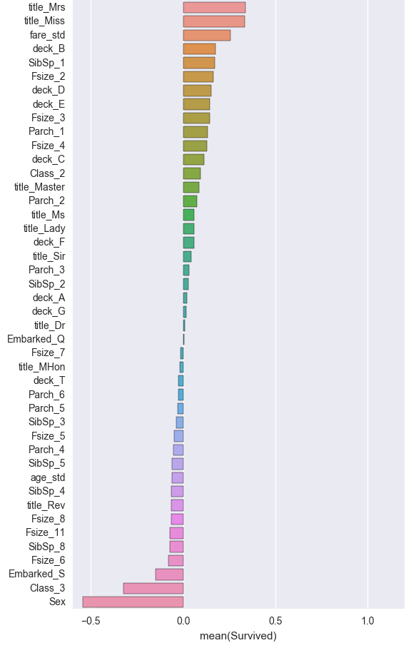
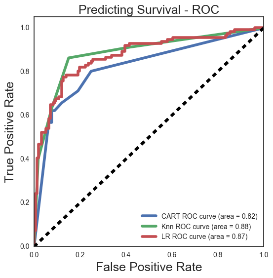

### Introduction

This week, we will be analyzing disaster relief and looking for insights into what factors are indicative of survival.  We will be using the Titanic dataset and using various classification techniques for predicting which passengers survived the shipwreck.

Using the titanic dataset will we be able to demonstrate applications of classification techniques for analyzing disaster management. Our specific findings however will probably not be very applicable today, as it has been over a hundred years since the wreck. 

### EDA

We are importing the dataset from General Assembly’s SQL database using SQL magic and bringing it into a dataframe for exploration.

After a quick look at the data, there are a few things that pop up for possible feature engineering. We’ve built a new feature for the travelling Family size for each passenger based on the existing features indicating the number of siblings, spouses, parents and children on board. We are also able to pull out the title of each passenger from the Name, which will be helpful for imputing missing age data. 

Additionally, we pulled out the deck for each passenger from the cabin feature. We can use this to see if location on the ship has any correlation to survival. This information is missing for most passengers, and difficult to impute, so its use will most likely be limited.

Next, we can impute the age using the median values for each title and class combination. Then, quickly grouping some of the features to our target we can see that sex, class and age seem to be important.

We dummied our variables for sex, class, deck, port of embark, family size, and title. Also, we standardized our features for age and fare to improve the efficiency of our Logistic regression. For our Knn model we min-max scaled age since most of our variables ended up being binary dummies. 

Doing an initial correlation chart we can see that sex and class have pretty strong correlation to survival.

### Models:

Before training our models on the data, we are using train_test_split to break out a training sample and test sample to use for validation. Additionally we are using grid search to find the best hyperparameters to use for each model.

We used Logistic regression, K Nearest Neighbors, and Decision Tree classifier for this project. Each model performed similarly scoring at about 82% accuracy after tuning. After using a bagging classifier on each on the Decision Tree improved and only slightly.

<a href="https://git.generalassemb.ly/anthonysull/project-5-classification-disaster-mgmt/blob/master/Project%205.ipynb">Link</a> to the jupyter notebook. 

