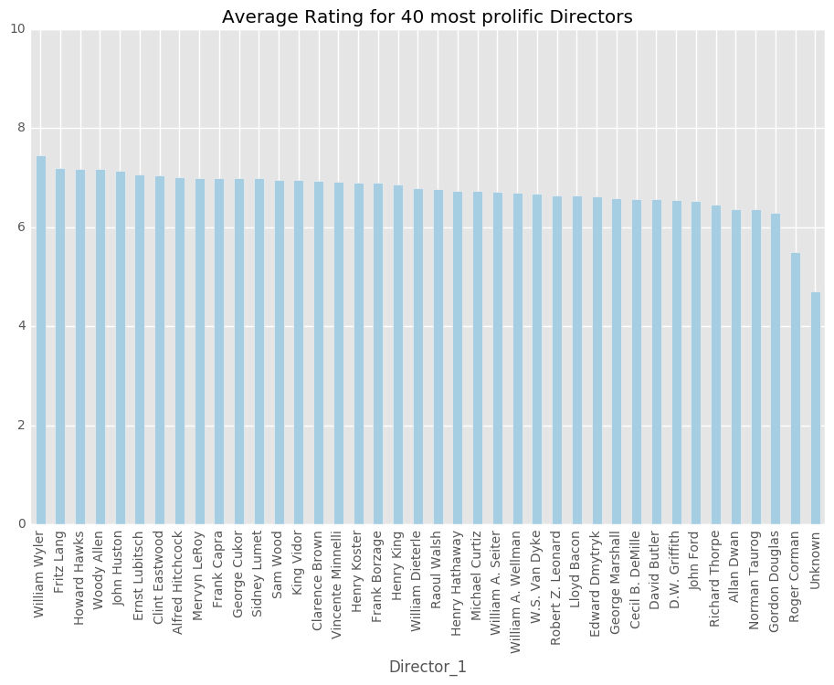
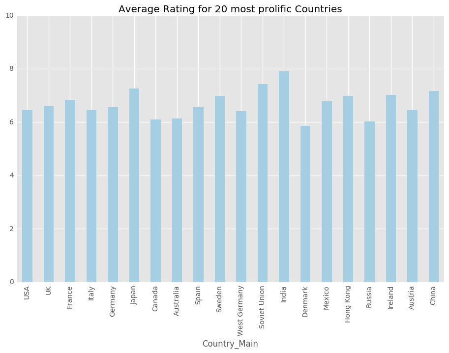
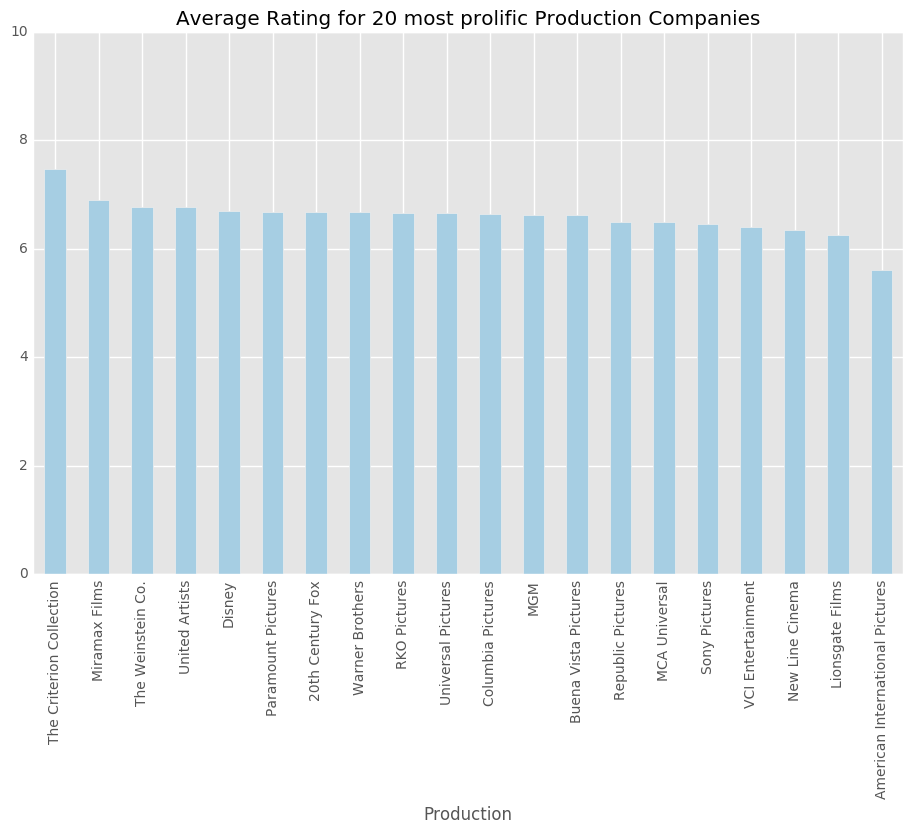
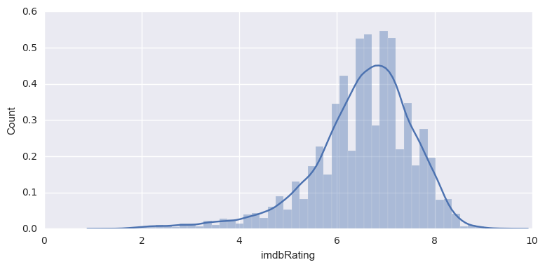
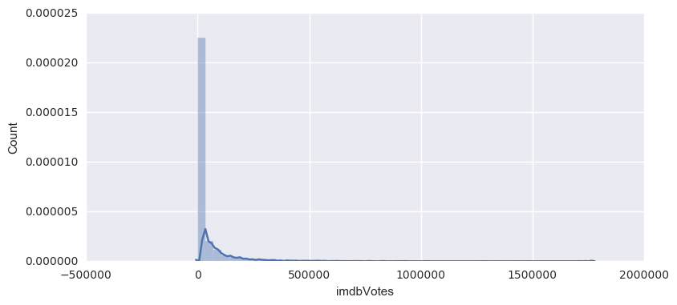
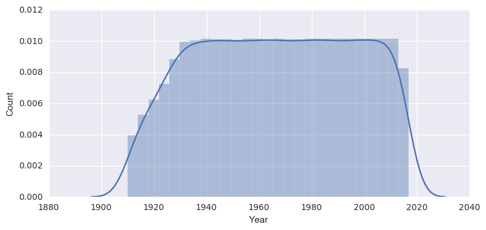
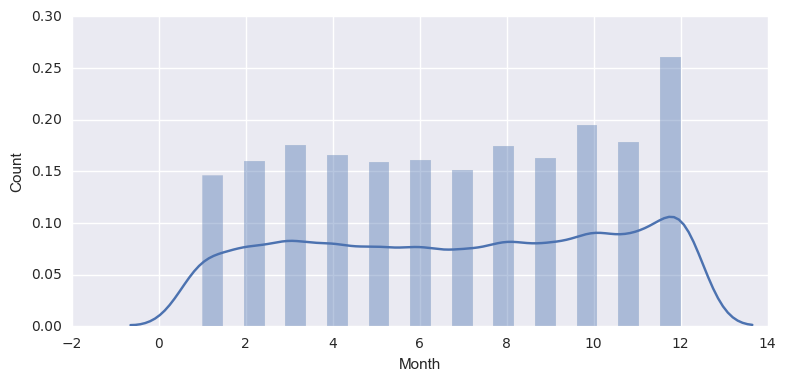
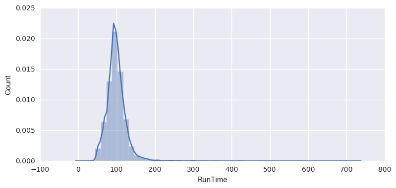

### Problem Statement

Can we determine the factors that lead to a high rating

### Goals

- Determine the factors that lead to a high imdb rating for feature films
- using ratings and review data obtained from IMDB for the top films according to IMDB.


```python
# Import our modules
# Pandas and numpy
import pandas as pd
import numpy as np
# Modules for webscraping from webpages and apis
import urllib
import requests
import json
from bs4 import BeautifulSoup
# Using re for string matching
import re
# matplotlib 
import matplotlib.pyplot as plt
%matplotlib inline
plt.style.use('ggplot')
```

### Lets use imdbpie to grab the top 250 movies


```python
# import Imdb from imdbpie
from imdbpie import Imdb
```


```python
# grab top 250 movies using imdbpie
imdb = Imdb()
imdb = Imdb(anonymize=True)
```


```python
top_250 = imdb.top_250()
```


```python
df_250 = pd.DataFrame(top_250)
```


```python
# Check for the oldest movie in the list
df_250['year'].min()
```


    u'1921'


```python
# Pull ids out into list
ids_250 = df_250['tconst']
```


```python
# Save list of ids out with pickle
import pickle
with open('ids_250_pickle', 'wb') as fp:
    pickle.dump(ids_250, fp)
```


```python
with open ('ids_250_pickle', 'rb') as fp:
    ids_250 = pickle.load(fp)
```

### Lets grab a bunch of movie title ids from imdb

from the past 100 years or so, making sure we cover the timespan of our top 250. <br> 
We will go back a few years before the oldest movie in the top 250 to make sure we grab <br>
some titles that may have been previously made with some of the same team


```python
# Function to request and soupify our results
def soupy(url):
    headers = {'User-Agent': 'Mozilla/5.0 (Macintosh; Intel Mac OS X 10_10_1) \
    AppleWebKit/537.36 (KHTML, like Gecko) Chrome/39.0.2171.95 Safari/537.36'}
    response = requests.get(url, headers=headers)
    content = response.content
    soup = BeautifulSoup(content, "lxml")
    return soup
```


```python
# url formaters, search imdb by year (from 1910 -) and grab first 3 pages (150 most popular movies) for each year
year_url = 'http://www.imdb.com/search/title?year={},{}&title_type=feature&sort=moviemeter,asc&page={}&ref_=adv_nxt'
years = range(1910,2018)
pages = range(1,4)
```


```python
# Function to grab title ids from imdb search pages
def get_titles(url):
    soup = soupy(url)
    try:
        titles = soup.findAll('h3', class_="lister-item-header")
        for i in titles:
            tt_link = i.find('a')['href']
            tt_id = tt_link.split('/')[2]
            title_ids.append(tt_id)      
    except AttributeError:
        tt_id = None     
```


```python
# Instantiate an empty list to hold our ids
title_ids = []

# Loop over each year and the first three pages to grab title ids
for year in years:
    for page in pages:
        get_titles(year_url.format(year,year,page))
```


```python
len(title_ids)
```


    16132


```python
# Append top 250 ids to most popular per year
for i in ids_250:
    title_ids.append(i)
```


```python
# Delete duplicate ids
title_ids_set = list(set(title_ids))
len(title_ids_set)
```


    16136


```python
# Pickle ids
with open('ids_pickle', 'wb') as fp:
    pickle.dump(title_ids_set, fp)
```

### Lets test grabbing our info using both the OMDBapi and imdb-pie


```python
%%timeit -o
# Time first 100 from OMDB
title_request = 'http://www.omdbapi.com/?i={}&plot=full'
info_omdb = []
for i in title_ids_set[:50]:
    url = title_request.format(i)
    response = requests.get(url)
    info_omdb.append(response.json()) 
```

    1 loop, best of 3: 3.66 s per loop


    <TimeitResult : 1 loop, best of 3: 3.66 s per loop>


```python
%%timeit -o
# Time first 100 from OMDB
title_request = 'http://www.omdbapi.com/?i={}&plot=full'
info_omdb = []
for i in title_ids_set[:50]:
    url = title_request.format(i)
    headers = {'User-Agent': 'Mozilla/5.0 (Macintosh; Intel Mac OS X 10_10_1) \
    AppleWebKit/537.36 (KHTML, like Gecko) Chrome/39.0.2171.95 Safari/537.36'}
    response = requests.get(url, headers=headers)
    info_omdb.append(response.json())
```

    1 loop, best of 3: 2.95 s per loop


    <TimeitResult : 1 loop, best of 3: 2.95 s per loop>


```python
%%timeit -o
# Time first 100 from imdbpie
info_imdbpie = []
for i in title_ids_set[:50]:
    title = imdb.get_title_by_id(i)
    info_imdbpie.append(title)
```

    1 loop, best of 3: 1min 47s per loop


    <TimeitResult : 1 loop, best of 3: 1min 47s per loop>


```python
# Take a look at the OMDB info
info_omdb_df = pd.DataFrame(info_omdb)
info_omdb_df.head(2)
```


<div>
<table border="1" class="dataframe">
  <thead>
    <tr style="text-align: right;">
      <th></th>
      <th>Actors</th>
      <th>Awards</th>
      <th>Country</th>
      <th>Director</th>
      <th>Genre</th>
      <th>Language</th>
      <th>Metascore</th>
      <th>Plot</th>
      <th>Poster</th>
      <th>Rated</th>
      <th>Released</th>
      <th>Response</th>
      <th>Runtime</th>
      <th>Title</th>
      <th>Type</th>
      <th>Writer</th>
      <th>Year</th>
      <th>imdbID</th>
      <th>imdbRating</th>
      <th>imdbVotes</th>
    </tr>
  </thead>
  <tbody>
    <tr>
      <th>0</th>
      <td>N/A</td>
      <td>N/A</td>
      <td>Poland</td>
      <td>Aleksander Hertz</td>
      <td>N/A</td>
      <td>Polish</td>
      <td>N/A</td>
      <td>N/A</td>
      <td>N/A</td>
      <td>N/A</td>
      <td>N/A</td>
      <td>True</td>
      <td>N/A</td>
      <td>Historia, jakich wiele</td>
      <td>movie</td>
      <td>N/A</td>
      <td>1912</td>
      <td>tt0437222</td>
      <td>N/A</td>
      <td>N/A</td>
    </tr>
    <tr>
      <th>1</th>
      <td>John Agar, Joyce Meadows, Robert Fuller, Thoma...</td>
      <td>N/A</td>
      <td>USA</td>
      <td>Nathan Juran</td>
      <td>Action, Adventure, Horror</td>
      <td>English</td>
      <td>N/A</td>
      <td>Gor, a powerful criminal brain from the planet...</td>
      <td>https://images-na.ssl-images-amazon.com/images...</td>
      <td>APPROVED</td>
      <td>01 Oct 1957</td>
      <td>True</td>
      <td>71 min</td>
      <td>The Brain from Planet Arous</td>
      <td>movie</td>
      <td>Ray Buffum (screenplay)</td>
      <td>1957</td>
      <td>tt0050210</td>
      <td>5.3</td>
      <td>1,109</td>
    </tr>
  </tbody>
</table>
</div>


```python
# Take a look at the imdbpie info
# info_imdbpie
```


```python
feats = ['rating','title', 'year', 'cast_summary', 'genres', 'imdb_id', 'directors_summary', 'certification','type']
df_imdbpie_test = pd.DataFrame([{fn: getattr(f, fn) for fn in feats} for f in info_imdbpie])
```


```python
df_imdbpie_test.head(2)
```


<div>
<table border="1" class="dataframe">
  <thead>
    <tr style="text-align: right;">
      <th></th>
      <th>cast_summary</th>
      <th>certification</th>
      <th>directors_summary</th>
      <th>genres</th>
      <th>imdb_id</th>
      <th>rating</th>
      <th>title</th>
      <th>type</th>
      <th>year</th>
    </tr>
  </thead>
  <tbody>
    <tr>
      <th>0</th>
      <td>[]</td>
      <td>None</td>
      <td>[&lt;Person: Aleksander Hertz (nm0381076)&gt;]</td>
      <td>None</td>
      <td>tt0437222</td>
      <td>NaN</td>
      <td>Historia, jakich wiele</td>
      <td>feature</td>
      <td>1912</td>
    </tr>
    <tr>
      <th>1</th>
      <td>[&lt;Person: John Agar (nm0000730)&gt;, &lt;Person: Joy...</td>
      <td>Approved</td>
      <td>[&lt;Person: Nathan Juran (nm0432846)&gt;]</td>
      <td>[Action, Adventure, Horror, Sci-Fi, Thriller]</td>
      <td>tt0050210</td>
      <td>5.3</td>
      <td>The Brain from Planet Arous</td>
      <td>feature</td>
      <td>1957</td>
    </tr>
  </tbody>
</table>
</div>


---
#### Which should we use?
The OMDBapi is working quite a bit faster than imdbpie here.  And looking at the data it returns <br>
(a json item) it will be easier to bring into a dataframe. <br> 

Imdbpie returns class instances with some embedded classes within them that will need a few more steps <br>
to clean when bringing into a dataframe. 

Though Imdb-pie's info is a bit more complete(includes producers, music ... in credits), <br>

So, I will use the OMDBapi, given that it is working about 16 times faster, and go back to <br>
scrap a few other items from IMDB's site.

---
### Now lets grab the info for all of our titles using the OMDbapi


```python
# List to capture title info
movie_info = []
```


```python
# Grab info for all titles using omdbapi
# The list of ids was subsetted and rerun for each group to avoid overloading the api
for t in title_ids_set[16000:]:
    args = {'i':t,'plot':'short','r':'json', 'tomatoes':'True'}
    url = 'http://www.omdbapi.com/' 
    r = requests.get(URL, params=args)
    movie_info.append(r.json())
```


```python
# Convert info to dataframe
movie_df = pd.DataFrame(movie_info)
```


```python
# Drop any duplicates
movie_df.drop_duplicates(subset='imdbID', inplace=True)
```


    (16137, 36)


```python
# Drop any null ids that resulted from our connection being kicked
movie_df = movie_df[movie_df.imdbID.notnull()]
```


```python
movie_df.shape
```


    (16136, 36)


```python
# Export dataframe with pickle
movie_df.to_pickle('movie_df.pkl')
```


```python
# Import dataframe with pickle
movie_df = pd.read_pickle('movie_df.pkl')
```


```python
movie_df.head(2)
```


<div>
<table border="1" class="dataframe">
  <thead>
    <tr style="text-align: right;">
      <th></th>
      <th>Actors</th>
      <th>Awards</th>
      <th>BoxOffice</th>
      <th>Country</th>
      <th>DVD</th>
      <th>Director</th>
      <th>Error</th>
      <th>Genre</th>
      <th>Language</th>
      <th>Metascore</th>
      <th>...</th>
      <th>tomatoFresh</th>
      <th>tomatoImage</th>
      <th>tomatoMeter</th>
      <th>tomatoRating</th>
      <th>tomatoReviews</th>
      <th>tomatoRotten</th>
      <th>tomatoURL</th>
      <th>tomatoUserMeter</th>
      <th>tomatoUserRating</th>
      <th>tomatoUserReviews</th>
    </tr>
  </thead>
  <tbody>
    <tr>
      <th>0</th>
      <td>N/A</td>
      <td>N/A</td>
      <td>N/A</td>
      <td>Poland</td>
      <td>N/A</td>
      <td>Aleksander Hertz</td>
      <td>NaN</td>
      <td>N/A</td>
      <td>Polish</td>
      <td>N/A</td>
      <td>...</td>
      <td>N/A</td>
      <td>N/A</td>
      <td>N/A</td>
      <td>N/A</td>
      <td>N/A</td>
      <td>N/A</td>
      <td>N/A</td>
      <td>N/A</td>
      <td>N/A</td>
      <td>N/A</td>
    </tr>
    <tr>
      <th>1</th>
      <td>John Agar, Joyce Meadows, Robert Fuller, Thoma...</td>
      <td>N/A</td>
      <td>N/A</td>
      <td>USA</td>
      <td>27 Feb 2001</td>
      <td>Nathan Juran</td>
      <td>NaN</td>
      <td>Action, Adventure, Horror</td>
      <td>English</td>
      <td>N/A</td>
      <td>...</td>
      <td>N/A</td>
      <td>N/A</td>
      <td>N/A</td>
      <td>N/A</td>
      <td>N/A</td>
      <td>N/A</td>
      <td>http://www.rottentomatoes.com/m/the_brain_from...</td>
      <td>N/A</td>
      <td>N/A</td>
      <td>N/A</td>
    </tr>
  </tbody>
</table>
<p>2 rows × 36 columns</p>
</div>


```python
movie_df.columns
```


    Index([u'Actors', u'Awards', u'BoxOffice', u'Country', u'DVD', u'Director',
           u'Error', u'Genre', u'Language', u'Metascore', u'Plot', u'Poster',
           u'Production', u'Rated', u'Released', u'Response', u'Runtime', u'Title',
           u'Type', u'Website', u'Writer', u'Year', u'imdbID', u'imdbRating',
           u'imdbVotes', u'tomatoConsensus', u'tomatoFresh', u'tomatoImage',
           u'tomatoMeter', u'tomatoRating', u'tomatoReviews', u'tomatoRotten',
           u'tomatoURL', u'tomatoUserMeter', u'tomatoUserRating',
           u'tomatoUserReviews'],
          dtype='object')


```python
# Drop unneeded columns
drop_columns = [u'DVD', u'Error', u'Poster', u'Response', u'Type', u'Website',
       u'tomatoConsensus', u'tomatoFresh', u'tomatoImage',
       u'tomatoMeter', u'tomatoRating', u'tomatoReviews', u'tomatoRotten',
       u'tomatoURL', u'tomatoUserMeter', u'tomatoUserRating',
       u'tomatoUserReviews']
```


```python
movie_df.drop(drop_columns, axis=1, inplace=True)
```


```python
movie_df.head(2)
```


<div>
<table border="1" class="dataframe">
  <thead>
    <tr style="text-align: right;">
      <th></th>
      <th>Actors</th>
      <th>Awards</th>
      <th>BoxOffice</th>
      <th>Country</th>
      <th>Director</th>
      <th>Genre</th>
      <th>Language</th>
      <th>Metascore</th>
      <th>Plot</th>
      <th>Production</th>
      <th>Rated</th>
      <th>Released</th>
      <th>Runtime</th>
      <th>Title</th>
      <th>Writer</th>
      <th>Year</th>
      <th>imdbID</th>
      <th>imdbRating</th>
      <th>imdbVotes</th>
    </tr>
  </thead>
  <tbody>
    <tr>
      <th>0</th>
      <td>N/A</td>
      <td>N/A</td>
      <td>N/A</td>
      <td>Poland</td>
      <td>Aleksander Hertz</td>
      <td>N/A</td>
      <td>Polish</td>
      <td>N/A</td>
      <td>N/A</td>
      <td>N/A</td>
      <td>N/A</td>
      <td>N/A</td>
      <td>N/A</td>
      <td>Historia, jakich wiele</td>
      <td>N/A</td>
      <td>1912</td>
      <td>tt0437222</td>
      <td>N/A</td>
      <td>N/A</td>
    </tr>
    <tr>
      <th>1</th>
      <td>John Agar, Joyce Meadows, Robert Fuller, Thoma...</td>
      <td>N/A</td>
      <td>N/A</td>
      <td>USA</td>
      <td>Nathan Juran</td>
      <td>Action, Adventure, Horror</td>
      <td>English</td>
      <td>N/A</td>
      <td>Gor, a powerful criminal brain from the planet...</td>
      <td>Howco International</td>
      <td>APPROVED</td>
      <td>01 Oct 1957</td>
      <td>71 min</td>
      <td>The Brain from Planet Arous</td>
      <td>Ray Buffum (screenplay)</td>
      <td>1957</td>
      <td>tt0050210</td>
      <td>5.3</td>
      <td>1,109</td>
    </tr>
  </tbody>
</table>
</div>


```python
# Replace N/A with nan
movie_df = movie_df.applymap(lambda x: np.nan if x == 'N/A' else x)
```


```python
movie_df.info()
```

    <class 'pandas.core.frame.DataFrame'>
    Int64Index: 16136 entries, 0 to 20459
    Data columns (total 19 columns):
    Actors        15980 non-null object
    Awards        7468 non-null object
    BoxOffice     2099 non-null object
    Country       16038 non-null object
    Director      16029 non-null object
    Genre         15577 non-null object
    Language      14905 non-null object
    Metascore     3542 non-null object
    Plot          14557 non-null object
    Production    11848 non-null object
    Rated         11635 non-null object
    Released      15490 non-null object
    Runtime       14789 non-null object
    Title         16136 non-null object
    Writer        15746 non-null object
    Year          16136 non-null object
    imdbID        16136 non-null object
    imdbRating    14937 non-null object
    imdbVotes     14931 non-null object
    dtypes: object(19)
    memory usage: 2.5+ MB


```python
# Drop titles without an imdb rating
rated_df = movie_df[movie_df['imdbRating'].notnull()]
```


```python
rated_df.info()
```

    <class 'pandas.core.frame.DataFrame'>
    Int64Index: 14937 entries, 1 to 20459
    Data columns (total 19 columns):
    Actors        14876 non-null object
    Awards        7460 non-null object
    BoxOffice     2098 non-null object
    Country       14913 non-null object
    Director      14896 non-null object
    Genre         14750 non-null object
    Language      14265 non-null object
    Metascore     3542 non-null object
    Plot          14188 non-null object
    Production    11779 non-null object
    Rated         11602 non-null object
    Released      14529 non-null object
    Runtime       14456 non-null object
    Title         14937 non-null object
    Writer        14798 non-null object
    Year          14937 non-null object
    imdbID        14937 non-null object
    imdbRating    14937 non-null object
    imdbVotes     14931 non-null object
    dtypes: object(19)
    memory usage: 2.3+ MB


```python
rated_df.reset_index(drop=True, inplace=True)
```

### Let's convert our numeric features to numeric


```python
# Strip imdbvotes string of commas
rated_df['imdbVotes'] = rated_df.loc[:,'imdbVotes'].str.replace(',','')
```

    /anaconda/lib/python2.7/site-packages/ipykernel/__main__.py:2: SettingWithCopyWarning: 
    A value is trying to be set on a copy of a slice from a DataFrame.
    Try using .loc[row_indexer,col_indexer] = value instead
    
    See the caveats in the documentation: http://pandas.pydata.org/pandas-docs/stable/indexing.html#indexing-view-versus-copy
      from ipykernel import kernelapp as app


```python
# List of columns to convert to numeric
to_convert = ['imdbRating', 'Metascore', 'Year', 'imdbVotes']
```


```python
# Loop through list of columns and convert
for i in to_convert:
    rated_df[i] = rated_df.loc[:,i].apply(pd.to_numeric)
```

    /anaconda/lib/python2.7/site-packages/ipykernel/__main__.py:3: SettingWithCopyWarning: 
    A value is trying to be set on a copy of a slice from a DataFrame.
    Try using .loc[row_indexer,col_indexer] = value instead
    
    See the caveats in the documentation: http://pandas.pydata.org/pandas-docs/stable/indexing.html#indexing-view-versus-copy
      app.launch_new_instance()


```python
rated_df.describe()
```

    //anaconda/lib/python2.7/site-packages/numpy/lib/function_base.py:4116: RuntimeWarning: Invalid value encountered in percentile
      interpolation=interpolation)


<div>
<table border="1" class="dataframe">
  <thead>
    <tr style="text-align: right;">
      <th></th>
      <th>Metascore</th>
      <th>Year</th>
      <th>imdbRating</th>
      <th>imdbVotes</th>
    </tr>
  </thead>
  <tbody>
    <tr>
      <th>count</th>
      <td>3542.000000</td>
      <td>14937.000000</td>
      <td>14937.000000</td>
      <td>1.493100e+04</td>
    </tr>
    <tr>
      <th>mean</th>
      <td>57.476285</td>
      <td>1966.674299</td>
      <td>6.528560</td>
      <td>3.425068e+04</td>
    </tr>
    <tr>
      <th>std</th>
      <td>18.419900</td>
      <td>29.252732</td>
      <td>1.041723</td>
      <td>9.456518e+04</td>
    </tr>
    <tr>
      <th>min</th>
      <td>1.000000</td>
      <td>1910.000000</td>
      <td>1.300000</td>
      <td>5.000000e+00</td>
    </tr>
    <tr>
      <th>25%</th>
      <td>NaN</td>
      <td>1942.000000</td>
      <td>6.000000</td>
      <td>NaN</td>
    </tr>
    <tr>
      <th>50%</th>
      <td>NaN</td>
      <td>1967.000000</td>
      <td>6.700000</td>
      <td>NaN</td>
    </tr>
    <tr>
      <th>75%</th>
      <td>NaN</td>
      <td>1992.000000</td>
      <td>7.200000</td>
      <td>NaN</td>
    </tr>
    <tr>
      <th>max</th>
      <td>100.000000</td>
      <td>2017.000000</td>
      <td>9.500000</td>
      <td>1.771273e+06</td>
    </tr>
  </tbody>
</table>
</div>


### Convert release date to datetime


```python
# Lets convert release date to datetime
from datetime import datetime
rated_df['Release_Date'] = pd.to_datetime(rated_df.loc[:,'Released'],format='%d %b %Y')
```

    /anaconda/lib/python2.7/site-packages/ipykernel/__main__.py:3: SettingWithCopyWarning: 
    A value is trying to be set on a copy of a slice from a DataFrame.
    Try using .loc[row_indexer,col_indexer] = value instead
    
    See the caveats in the documentation: http://pandas.pydata.org/pandas-docs/stable/indexing.html#indexing-view-versus-copy
      app.launch_new_instance()


### Clean production column


```python
rated_df.Production.nunique()
```


    1549


```python
rated_df.Production.value_counts()[:25]
```


    Paramount Pictures                          718
    MGM                                         565
    Universal Pictures                          443
    Warner Home Video                           431
    Warner Bros. Pictures                       425
    United Artists                              390
    20th Century Fox                            369
    Columbia Pictures                           356
    MGM Home Entertainment                      321
    20th Century Fox Film Corporation           308
    Warner Bros.                                307
    Sony Pictures Home Entertainment            290
    Criterion Collection                        241
    MCA Universal Home Video                    215
    WARNER BROTHERS PICTURES                    204
    Twentieth Century Fox Home Entertainment    201
    Universal                                   192
    Sony Pictures Entertainment                 141
    Paramount Home Video                        137
    Sony Pictures                               108
    New Line Cinema                             100
    Miramax Films                                96
    RKO Pictures                                 93
    Fox                                          92
    RKO Radio Pictures                           91
    Name: Production, dtype: int64


```python
from fuzzywuzzy import fuzz
from fuzzywuzzy import process
```


```python
choices = set(rated_df['Production'])
process.extract('Fox', choices, limit=15)
```


    [(u'CBS/Fox', 90),
     (u'20th Century Fox', 90),
     (u'Foreign Cinema Arts Inc.', 60),
     (u'April Fools', 60),
     (u'Force Video', 60),
     (u'Focus Features', 60),
     (u'Mary Pickford Company', 60),
     (u'Foremco', 60),
     (u'FilmFour', 60),
     (u'Music Box Films', 60),
     (u'Roxie Releasing', 60),
     (u'Box Office Spectaculars', 60),
     (u'Floralva Exclusivas', 60),
     (u'Lamberto Forni Film (LF)', 60),
     (u'Mayflower Pictures', 60)]


```python
# Create a dictionary of production company replacements 
replacements = {
    'Production': {
        r'^Howco.*': 'Howco International Pictures',
        r'^Sony.*': 'Sony Pictures',
        r'^Twentieth Century.*': '20th Century Fox',
        r'^20th.*': '20th Century Fox',
        r'^Century Fox': '20th Century Fox',
        r'^Fox Film.*': '20th Century Fox',
        r'^Fox International': '20th Century Fox',
        r'^Fox Home.*': '20th Century Fox',
        r'^Fox': '20th Century Fox',
        r'^Fox Searchlight.*': 'Fox Searchlight',
        r'^21st Century.*': '21st Century Film',
        r'^Tri[\sSs][St].*': 'TriStar Pictures',
        r'^Columbia Tr.*': 'TriStar Pictures',
        r'^Columbia.*': 'Columbia Pictures',
        r'^Cosm.*': 'Cosmopolitan Productions',
        r'^Toho.*': 'Toho Company',
        r'^MGM.*': 'MGM',
        r'^Metro[ -]G.*': 'MGM',
        r'^Metro.*':'Metro Pictures',
        r'^Vestron.*':'Vestron Pictures',
        r'^Milestone Fil.*':'Milestone Film',
        r'^W[Aa][Rr]?[Nn][Ee][Rr]s?\s?[BH].*':'Warner Brothers',
        r'^WARNER': 'Warner Brothers',
        r'^Warner I.*': 'Warner Independent',
        r'^Walter W.*':'Walter Wanger',
        r'^Water Bearer.*':'Water Bearer Films',
        r'^Arthur Mayer.*':'Arthur Mayer Edward Kingsley I',
        r'^Path[^f].*': 'Pathe',
        r"^Lions?[Gg].*.*": 'Lionsgate Films',
        r"^Lions?'?s?\sG.*": "Lion's Gate Films",
        r"^MCA.*": 'MCA Universal',
        r"^Universum F.*":'Universum Film',
        r'^New Li.*': "New Line Cinema",
        r'^New World.*':'New World Pictures',
        r'^RKO.*':'RKO Pictures',
        r'^Dream\s?W.*': 'DreamWorks',
        r'^Paramou.*':'Paramount Pictures',
        r'^Mir[ai]max.*': 'Miramax Films',
        r'^Allied Artists.*':'Allied Artists Pictures',
        r'^Amazon.*': 'Amazon Studios',
        r'^Cinerama.*':'Cinerama',
        r'^Artisan.*':'Artisan Pictures',
        r'^Pacific Arts.*':'Pacific Arts',
        r'^IFC.*':'IFC Films',
        r'^Magnolia.*':'Magnolia Pictures',
        r'^Magnet.*':'Magnet Releasing',
        r'^Weinstein.*':'The Weinstein Co.',
        r'^The Weinstein Co.*': 'The Weinstein Co.',
        r'^Winstar.*':'Winstar Cinema',
        r'^BFI.*':'British Film Institute',
        r'^VCI.*':'VCI Entertainment',
        r'^Home Box.*':'HBO',
        r'^HBO.*':'HBO',
        r'^Criterion.*':'The Criterion Collection',
        r'^American Int.*':'American International Pictures',
        r'^Independent Int.*':'Independent International Pictures',
        r'^Independ[ae]nt Pi.*':'Independent Pictures',
        r'^Relativity.*':'Relativity Media',
        r'^STARZ MEDIA.*': 'Starz',
        r'^Associated First National P.*': 'First National Pictures',
        r'^First National P.*': 'First National Pictures',
        r'^Tartan.*':'Tartan Films',
        r'^Burroughs-Tarzan Ente.*':'Burroughs-Tarzan Enterprises',
        r'^Focus .*':'Focus Features',
        r'.*?Rogue.*':'Rogue Pictures',
        r'^Anchor Bay.*':'Anchor Bay Films',
        r'^Touchstone.*':'Touchstone Pictures',
        r'^CBS .*':'CBS Films',
        r'^De Laurentiis Ent.*':'De Laurentiis Entertainment Group',
        r'.*Concorde.*':'New Horizons Pictures',
        r'New Horizons.*':'New Horizons Pictures',
        r'American Pop.*':'American Pop Classics',
        r'Republic.*':'Republic Pictures',
        r'.*Embassy.*':'Embassy Pictures',
        r'^Screen Gems.*':'Screen Gems',
        r'^Rialto.*':'Rialto Pictures',
        r'^Summit.*':'Summit Entertainment',
        r'^Dimension.*':'Dimension Films',
        r'^Monogram.*':'Monogram Pictures',
        r'^Open Road.*':'Open Road Films',
        r'.*Goldwyn.*':'Samuel Goldwyn Films',
        r'^Roadside At.*':'Roadside Attractions',
        r'^PolyGram.*':'PolyGram Films',
        r'^First Nation.*':'First National Pictures',
        r'^Hollywood Pic.*':'Hollywood Pictures',
        r'^A24.*':'A24 Films',
        r'^Kino.*':'Kino',
        r"^Loew's.*":"Loew's Inc.",
        r'^Artkino Pict.*':'Artkino Pictures',
        r'^Gramercy.*':'Gramercy Pictures',
        r'Buena Vista.*': 'Buena Vista Pictures',
        r'.*Disney.*': 'Disney',
        r'^Dream[Ww]orks.*': 'DreamWorks',
        r'^Twentieth Century Fox.*': '20th Century Fox',
        r'Warner Bros\..*': 'Warner Bros.',
        r'Walt Disney': 'Disney',
        r'Hollywood/Buena Vista Pictures': 'Buena Vista Pictures',
        r'UTV.*': 'UTV Motion Pictures',
        r'United Artists.*': 'United Artists',
        r'Universal.*': 'Universal Pictures',
        r'Paramount.*': 'Paramount Pictures',
        r'Orion.*': 'Orion Pictures',
        r'Newmarket Film.*': 'Newmarket Film Group',
        r'^United Film Distribution.*':'United Film Distribution Company',
        r'^Cannon.*':'Cannon Films',
        r'^Group 1.*':'Group 1',
        r'^UN': 'Universal Pictures',
        r'^Millenn?ium En.*': 'Millennium Entertainment',
    }
}
```


```python
rated_df.replace(replacements, regex=True, inplace=True)
```


```python
rated_df.Production.nunique()
```


    1203


```python
rated_df.Production.value_counts()[:25]
```


    Warner Brothers                    1416
    20th Century Fox                   1170
    Paramount Pictures                  947
    MGM                                 937
    Universal Pictures                  726
    Sony Pictures                       680
    United Artists                      395
    Columbia Pictures                   376
    The Criterion Collection            243
    MCA Universal                       223
    RKO Pictures                        200
    Buena Vista Pictures                194
    Disney                              165
    Miramax Films                       163
    Lionsgate Films                     149
    New Line Cinema                     147
    VCI Entertainment                    93
    Republic Pictures                    74
    American International Pictures      72
    The Weinstein Co.                    71
    DreamWorks                           70
    HBO                                  69
    Anchor Bay Films                     68
    Orion Pictures                       62
    Focus Features                       60
    Name: Production, dtype: int64


```python
rated_df.Production.isnull().sum()
```


    3158


```python
rated_df['Production'][rated_df['Title'] == 'Mad Max'] = 'Kennedy Miller Productions'
```

    /anaconda/lib/python2.7/site-packages/ipykernel/__main__.py:1: SettingWithCopyWarning: 
    A value is trying to be set on a copy of a slice from a DataFrame
    
    See the caveats in the documentation: http://pandas.pydata.org/pandas-docs/stable/indexing.html#indexing-view-versus-copy
      if __name__ == '__main__':
    //anaconda/lib/python2.7/site-packages/pandas/core/generic.py:4485: SettingWithCopyWarning: 
    A value is trying to be set on a copy of a slice from a DataFrame
    
    See the caveats in the documentation: http://pandas.pydata.org/pandas-docs/stable/indexing.html#indexing-view-versus-copy
      self._update_inplace(new_data)
    //anaconda/lib/python2.7/site-packages/IPython/core/interactiveshell.py:2881: SettingWithCopyWarning: 
    A value is trying to be set on a copy of a slice from a DataFrame
    
    See the caveats in the documentation: http://pandas.pydata.org/pandas-docs/stable/indexing.html#indexing-view-versus-copy
      exec(code_obj, self.user_global_ns, self.user_ns)


```python
rated_df['Production'][rated_df['Title'] == 'The Night Porter'] = 'Lotar Film Productions'
```

    /anaconda/lib/python2.7/site-packages/ipykernel/__main__.py:1: SettingWithCopyWarning: 
    A value is trying to be set on a copy of a slice from a DataFrame
    
    See the caveats in the documentation: http://pandas.pydata.org/pandas-docs/stable/indexing.html#indexing-view-versus-copy
      if __name__ == '__main__':


### Grab month as feature


```python
import warnings
warnings.filterwarnings('ignore')
```


```python
rated_df['Month'] = rated_df.loc[:,"Release_Date"].apply(lambda x: x.month)
```

### Grab awards won


```python
def awards(string):
    wins = re.compile(r"\d\d?")
    #awards = []
    ow = 0
    on = 0
    w = 0
    n = 0
    try:
        listed = string.split('.')
        for l in listed:
            if 'Oscar' in l and l[0] == 'W':
                ow = wins.findall(l)[0]
            elif 'Oscar' in l and l[0] == 'N':
                on = wins.findall(l)[0]
            elif 'win' in l and 'nomination' in l:
                w = wins.findall(l)[0]
                n = wins.findall(l)[1]
            elif 'nomination' in l and 'win' not in l:
                n = wins.findall(l)[0]
            else:
                None
        
    except:
        None
    return [ow,on,w,n]
```


```python
rated_df['Awards_'] = rated_df['Awards'].apply(awards)
```


```python
rated_df['Oscar_wins'] = rated_df['Awards_'].apply(lambda x: x[0])
```


```python
rated_df['Oscar_noms'] = rated_df['Awards_'].apply(lambda x: x[1])
```


```python
rated_df['Award_wins'] = rated_df['Awards_'].apply(lambda x: x[2])
```


```python
rated_df['Award_noms'] = rated_df['Awards_'].apply(lambda x: x[3])
```


```python
rated_df.drop(['Awards','Awards_'], axis=1, inplace=True)
```

### Clean Runtime


```python
def runtime(string):
    ints = re.compile(r"\d\d?\d?")
    try:
        if 'h' in string and 'min' in string:
            run = int(ints.findall(string)[0])*60 + int(ints.findall(string)[1])
        elif 'h' in string:
            run = int(ints.findall(string)[0])*60
        elif 'min' in string:
            run = int(ints.findall(string)[0])
        else:
            run = np.nan
    except:
        run = np.nan
    return run       
```


```python
rated_df['RunTime'] = rated_df['Runtime'].apply(runtime)
```


```python
rated_df.drop(['Runtime'], axis=1, inplace=True)
```


```python
rated_df['RunTime'].isnull().sum()
```


    481


```python
# Impute missing Runtimes with median for year
rated_df['RunTime'].fillna(rated_df.groupby(['Year'])['RunTime'].transform("median"), inplace=True)
```


```python
rated_df['RunTime'].isnull().sum()
```


    0


### Break out genres


```python
def genre_1(string):
    clean_list = []
    try:
        listy = string.split(',')
        for l in listy:
            clean = l.strip()
            clean_list.append(clean)
        return clean_list[0] 
    except:
        return 'None'
```


```python
rated_df['genre_1'] = rated_df["Genre"].apply(genre_1)
```


```python
def genre_2(string):
    clean_list = []
    try:
        listy = string.split(',')
        for l in listy:
            clean = l.strip()
            clean_list.append(clean)
        return clean_list[1] 
    except:
        return 'None'
```


```python
rated_df['genre_2'] = rated_df["Genre"].apply(genre_2)
```


```python
def genre_3(string):
    clean_list = []
    try:
        listy = string.split(',')
        for l in listy:
            clean = l.strip()
            clean_list.append(clean)
        return clean_list[2] 
    except:
        return 'None'
```


```python
rated_df['genre_3'] = rated_df["Genre"].apply(genre_3)
```


```python
rated_df['genre_1'].unique()
```


    array([u'Action', u'Adventure', u'Drama', u'Comedy', u'Crime', u'Western',
           u'Animation', u'Romance', u'Mystery', u'Biography', u'Horror',
           u'Family', u'War', u'Musical', u'Fantasy', u'Thriller', u'Sci-Fi',
           'None', u'Short', u'Film-Noir', u'Music', u'History'], dtype=object)


```python
rated_df['genre_1'].nunique()
```


    22


```python
genre_1 = rated_df['genre_1'].unique()
```


```python
# Dummy genre
for genre in genre_1:
    if genre in rated_df['genre_1']:
        rated_df[genre] = 1
    else:
        rated_df[genre] = 0
```

### Check Director Feature for duplicates


```python
rated_df.Director.nunique()
```


    4779


```python
rated_df.Director.value_counts()[:20]
```


    Michael Curtiz        78
    John Ford             75
    Raoul Walsh           58
    Cecil B. DeMille      55
    Alfred Hitchcock      53
    Henry Hathaway        46
    William A. Wellman    45
    Richard Thorpe        43
    Fritz Lang            43
    King Vidor            40
    D.W. Griffith         39
    Woody Allen           39
    George Cukor          39
    Clarence Brown        38
    Norman Taurog         37
    Ernst Lubitsch        37
    Mervyn LeRoy          36
    Frank Borzage         35
    Henry King            34
    Howard Hawks          34
    Name: Director, dtype: int64


```python
choices_d = set(rated_df['Director'])
process.extract('Lana Wachowski', choices_d, limit=15)
```


    [(u'Lana Wachowski, Lilly Wachowski', 90),
     (u'Tom Tykwer, Lana Wachowski, Lilly Wachowski', 90),
     (nan, 60),
     (u'Alan Cohn', 60),
     (u'Alan White', 58),
     (u'Andrea Bianchi', 57),
     (u'Andy Warhol', 56),
     (u'Alan Rafkin', 56),
     (u'Andrzej Zulawski', 53),
     (u'Andrey Konchalovskiy', 53),
     (u'Jack Delano', 53),
     (u'Shane Meadows', 52),
     (u'Lyndall Hobbs', 52),
     (u'Susanna White', 52),
     (u'Ngai Choi Lam', 52)]


Combine a few common teams


```python
rated_df['Director'] = rated_df['Director'].str.replace('Ethan Coen, Joel Coen', 'Joel Coen, Ethan Coen')
```


```python
rated_df['Director'] = rated_df['Director'].str.replace('Joel Coen, Ethan Coen', 'Joel & Ethan Coen')
```


```python
rated_df['Director'] = rated_df['Director'].str.replace('Bobby Farrelly, Peter Farrelly', 'Peter Farrelly, Bobby Farrelly')
```


```python
rated_df['Director'] = rated_df['Director'].str.replace('Peter Farrelly, Bobby Farrelly', 'Bobby & Peter Farrelly')
```


```python
rated_df['Director'] = rated_df['Director'].str.replace('Michael Powell, Emeric Pressburger', 'Michael Powell & Emeric Pressburger')
```


```python
rated_df['Director'] = rated_df['Director'].str.replace('Lana Wachowski, Lilly Wachowski', "The Wachowski's")
```


```python
# Define a function to grab to first Director for each feature
def director(string):
    clean_list = []
    try:
        listy = string.split(',')
        for l in listy:
            clean = l.strip()
            clean_list.append(clean)
        return clean_list[0] 
    except:
        return np.nan
```


```python
rated_df['Director_1'] = rated_df['Director'].apply(director)
```


```python
rated_df['Director_1'].nunique()
```


    4160


```python
rated_df['Director_1'].isnull().sum()
```


    41


```python
rated_df['Director_1'] = rated_df['Director_1'].fillna('Unknown')
```


```python
rated_df['Director_1'].isnull().sum()
```


    0


```python
director_40 = rated_df['Director_1'].value_counts().head(40)
director_40 = pd.DataFrame(director_40)
director_40.reset_index(inplace=True)
director_40.columns = ['Director_1', 'Value']
```


```python
directors = rated_df[["Director_1", "imdbRating"]].groupby(['Director_1'], \
                                            as_index=False).mean()
```


```python
top_directors = rated_df[["Director_1", "imdbRating"]].groupby(['Director_1'], \
                                            as_index=False).mean().sort_values('imdbRating', ascending=False)
```


```python
director_info = pd.merge(director_40, directors, how='left')
director_info = director_info.sort_values('imdbRating', ascending=False)
```


```python
director_info.plot('Director_1', 'imdbRating', kind='bar', figsize=(10,7), legend=False, xticks=None,\
                title = 'Average Rating for 40 most prolific Directors', ylim=(0,10), colormap='Paired')
```


    <matplotlib.axes._subplots.AxesSubplot at 0x34637e990>





```python
director_count = rated_df['Director_1'].value_counts()
director_count = pd.DataFrame(director_count)
director_count.reset_index(inplace=True)
director_count.columns = ['Director_1', 'Value']
```


```python
director_5 = director_count[director_count.Value > 5]
director_5.head()
```


<div>
<table border="1" class="dataframe">
  <thead>
    <tr style="text-align: right;">
      <th></th>
      <th>Director_1</th>
      <th>Value</th>
    </tr>
  </thead>
  <tbody>
    <tr>
      <th>0</th>
      <td>Michael Curtiz</td>
      <td>84</td>
    </tr>
    <tr>
      <th>1</th>
      <td>John Ford</td>
      <td>82</td>
    </tr>
    <tr>
      <th>2</th>
      <td>Raoul Walsh</td>
      <td>60</td>
    </tr>
    <tr>
      <th>3</th>
      <td>Cecil B. DeMille</td>
      <td>56</td>
    </tr>
    <tr>
      <th>4</th>
      <td>Alfred Hitchcock</td>
      <td>53</td>
    </tr>
  </tbody>
</table>
</div>


```python
director_5_rating = pd.merge(director_5, top_directors, how='left')
director_5_rating = director_5_rating.sort_values('imdbRating', ascending=False)
director_5_rating = director_5_rating.head(40)
director_5_rating
```


<div>
<table border="1" class="dataframe">
  <thead>
    <tr style="text-align: right;">
      <th></th>
      <th>Director_1</th>
      <th>Value</th>
      <th>imdbRating</th>
    </tr>
  </thead>
  <tbody>
    <tr>
      <th>577</th>
      <td>Masaki Kobayashi</td>
      <td>6</td>
      <td>8.483333</td>
    </tr>
    <tr>
      <th>375</th>
      <td>Christopher Nolan</td>
      <td>9</td>
      <td>8.333333</td>
    </tr>
    <tr>
      <th>645</th>
      <td>Satyajit Ray</td>
      <td>6</td>
      <td>8.250000</td>
    </tr>
    <tr>
      <th>441</th>
      <td>Andrei Tarkovsky</td>
      <td>8</td>
      <td>8.100000</td>
    </tr>
    <tr>
      <th>357</th>
      <td>Hayao Miyazaki</td>
      <td>10</td>
      <td>8.080000</td>
    </tr>
    <tr>
      <th>547</th>
      <td>Krzysztof Kieslowski</td>
      <td>7</td>
      <td>8.028571</td>
    </tr>
    <tr>
      <th>533</th>
      <td>Sergio Leone</td>
      <td>7</td>
      <td>7.971429</td>
    </tr>
    <tr>
      <th>275</th>
      <td>Quentin Tarantino</td>
      <td>11</td>
      <td>7.881818</td>
    </tr>
    <tr>
      <th>656</th>
      <td>Mario Monicelli</td>
      <td>6</td>
      <td>7.833333</td>
    </tr>
    <tr>
      <th>602</th>
      <td>Henri-Georges Clouzot</td>
      <td>6</td>
      <td>7.816667</td>
    </tr>
    <tr>
      <th>318</th>
      <td>Jean-Pierre Melville</td>
      <td>10</td>
      <td>7.810000</td>
    </tr>
    <tr>
      <th>286</th>
      <td>Kenji Mizoguchi</td>
      <td>11</td>
      <td>7.809091</td>
    </tr>
    <tr>
      <th>228</th>
      <td>Stanley Kubrick</td>
      <td>13</td>
      <td>7.807692</td>
    </tr>
    <tr>
      <th>610</th>
      <td>Kar-Wai Wong</td>
      <td>6</td>
      <td>7.800000</td>
    </tr>
    <tr>
      <th>587</th>
      <td>Alejandro G. Iñárritu</td>
      <td>6</td>
      <td>7.766667</td>
    </tr>
    <tr>
      <th>351</th>
      <td>David Fincher</td>
      <td>10</td>
      <td>7.750000</td>
    </tr>
    <tr>
      <th>629</th>
      <td>Chan-wook Park</td>
      <td>6</td>
      <td>7.750000</td>
    </tr>
    <tr>
      <th>196</th>
      <td>Luchino Visconti</td>
      <td>14</td>
      <td>7.721429</td>
    </tr>
    <tr>
      <th>91</th>
      <td>Yasujirô Ozu</td>
      <td>20</td>
      <td>7.715000</td>
    </tr>
    <tr>
      <th>315</th>
      <td>Robert Bresson</td>
      <td>11</td>
      <td>7.709091</td>
    </tr>
    <tr>
      <th>59</th>
      <td>Ingmar Bergman</td>
      <td>25</td>
      <td>7.688000</td>
    </tr>
    <tr>
      <th>615</th>
      <td>Denis Villeneuve</td>
      <td>6</td>
      <td>7.683333</td>
    </tr>
    <tr>
      <th>296</th>
      <td>Orson Welles</td>
      <td>11</td>
      <td>7.672727</td>
    </tr>
    <tr>
      <th>412</th>
      <td>Milos Forman</td>
      <td>9</td>
      <td>7.666667</td>
    </tr>
    <tr>
      <th>460</th>
      <td>Max Ophüls</td>
      <td>8</td>
      <td>7.662500</td>
    </tr>
    <tr>
      <th>542</th>
      <td>Wim Wenders</td>
      <td>7</td>
      <td>7.657143</td>
    </tr>
    <tr>
      <th>141</th>
      <td>Charles Chaplin</td>
      <td>17</td>
      <td>7.652941</td>
    </tr>
    <tr>
      <th>44</th>
      <td>Akira Kurosawa</td>
      <td>30</td>
      <td>7.646667</td>
    </tr>
    <tr>
      <th>168</th>
      <td>David Lean</td>
      <td>15</td>
      <td>7.640000</td>
    </tr>
    <tr>
      <th>448</th>
      <td>Rainer Werner Fassbinder</td>
      <td>8</td>
      <td>7.625000</td>
    </tr>
    <tr>
      <th>84</th>
      <td>Luis Buñuel</td>
      <td>21</td>
      <td>7.623810</td>
    </tr>
    <tr>
      <th>183</th>
      <td>François Truffaut</td>
      <td>15</td>
      <td>7.620000</td>
    </tr>
    <tr>
      <th>582</th>
      <td>Alfonso Cuarón</td>
      <td>6</td>
      <td>7.616667</td>
    </tr>
    <tr>
      <th>227</th>
      <td>Peter Jackson</td>
      <td>13</td>
      <td>7.615385</td>
    </tr>
    <tr>
      <th>411</th>
      <td>Marcel Carné</td>
      <td>9</td>
      <td>7.611111</td>
    </tr>
    <tr>
      <th>449</th>
      <td>Wes Anderson</td>
      <td>8</td>
      <td>7.575000</td>
    </tr>
    <tr>
      <th>61</th>
      <td>Billy Wilder</td>
      <td>25</td>
      <td>7.568000</td>
    </tr>
    <tr>
      <th>293</th>
      <td>David Lynch</td>
      <td>11</td>
      <td>7.563636</td>
    </tr>
    <tr>
      <th>321</th>
      <td>John Cassavetes</td>
      <td>10</td>
      <td>7.560000</td>
    </tr>
    <tr>
      <th>175</th>
      <td>Federico Fellini</td>
      <td>15</td>
      <td>7.560000</td>
    </tr>
  </tbody>
</table>
</div>


```python
director_5_rating.plot('Director_1', 'imdbRating', kind='bar', figsize=(10,7), legend=False, xticks=None,\
                title = 'Top Rated Directors (>5 films represented)', ylim=(0,10), colormap='Paired')
```


    <matplotlib.axes._subplots.AxesSubplot at 0x3511a8390>


```python
directors_5up = director_5['Director_1']
```


```python
len(directors_5up)
```


    658


```python
# Dummy important directors
# Since director seams so important we will use the 658 for dummies
for dirc in directors_5up:
    if dirc in rated_df['Director_1']:
        rated_df[dirc] = 1
    else:
        rated_df[dirc] = 0
```

### Language


```python
rated_df['Language'].nunique()
```


    959


```python
rated_df['Language_main'] = rated_df['Language'].apply(director)
```


```python
rated_df['Language_main'].nunique()
```


    57


```python
rated_df['Language_main'].value_counts()[:20]
```


    English       12439
    French          504
    Italian         324
    German          236
    Japanese        186
    Spanish         127
    Swedish          63
    Russian          61
    Hindi            56
    Mandarin         33
    Cantonese        32
    Danish           26
    Korean           15
    Czech            15
    Polish           15
    Turkish          14
    Portuguese       12
    Dutch             9
    Hungarian         8
    Greek             8
    Name: Language_main, dtype: int64


```python
rated_df['Language_main'] = rated_df['Language_main'].fillna('English')
```


```python
rated_df['Language_main'].value_counts()[:20]
```


    English       13111
    French          504
    Italian         324
    German          236
    Japanese        186
    Spanish         127
    Swedish          63
    Russian          61
    Hindi            56
    Mandarin         33
    Cantonese        32
    Danish           26
    Korean           15
    Czech            15
    Polish           15
    Turkish          14
    Portuguese       12
    Dutch             9
    Hungarian         8
    Greek             8
    Name: Language_main, dtype: int64


```python
rated_df['Language_main'].isnull().sum()
```


    0


### Rating


```python
rated_df['Rated'] = rated_df['Rated'].str.lower()
```


```python
rated_df['Rated'].unique()
```


    array([u'approved', u'pg', u'r', u'pg-13', nan, u'g', u'passed', u'tv-g',
           u'not rated', u'unrated', u'm', u'tv-pg', u'gp', u'x', u'nc-17',
           u'tv-ma', u'tv-14'], dtype=object)


```python
rated_df['Rated'] = rated_df['Rated'].fillna('None')
```


```python
rated_df['Rated'].isnull().sum()
```


    0


```python
rating_dum = rated_df['Rated'].unique()
```


```python
# Dummy rating
for rate in rating_dum:
    if rate in rated_df['Rated']:
        rated_df[rate+' Rated'] = 1
    else:
        rated_df[rate+' Rated'] = 0
```


```python
rated_df.columns
```


    Index([         u'Actors',       u'BoxOffice',         u'Country',
                  u'Director',           u'Genre',        u'Language',
                 u'Metascore',            u'Plot',      u'Production',
                     u'Rated',
           ...
                u'tv-g Rated', u'not rated Rated',   u'unrated Rated',
                   u'm Rated',     u'tv-pg Rated',        u'gp Rated',
                   u'x Rated',     u'nc-17 Rated',     u'tv-ma Rated',
               u'tv-14 Rated'],
          dtype='object', length=887)


### Country


```python
rated_df['Country'].nunique()
```


    766


```python
rated_df['Country_Main'] = rated_df['Country'].apply(director)
```


```python
rated_df['Country_Main'].nunique()
```


    64


```python
rated_df['Country_Main'].value_counts()[:20]
```


    USA             10505
    UK               1566
    France            653
    Italy             437
    Germany           270
    Japan             208
    Canada            154
    Australia         127
    Spain             105
    Sweden             95
    West Germany       76
    Soviet Union       74
    India              73
    Denmark            63
    Mexico             61
    Hong Kong          54
    Russia             28
    Ireland            26
    Austria            23
    China              22
    Name: Country_Main, dtype: int64


```python
rated_df['Country_Main'] = rated_df['Country_Main'].fillna('USA')
```


```python
rated_df['Country_Main'].isnull().sum()
```


    0


```python
country_values = rated_df['Country_Main'].value_counts()
country_values = pd.DataFrame(country_values)
country_values.reset_index(inplace=True)
country_values.columns = ['Country_Main', 'Values']
country_values.head()
```


<div>
<table border="1" class="dataframe">
  <thead>
    <tr style="text-align: right;">
      <th></th>
      <th>Country_Main</th>
      <th>Values</th>
    </tr>
  </thead>
  <tbody>
    <tr>
      <th>0</th>
      <td>USA</td>
      <td>10529</td>
    </tr>
    <tr>
      <th>1</th>
      <td>UK</td>
      <td>1566</td>
    </tr>
    <tr>
      <th>2</th>
      <td>France</td>
      <td>653</td>
    </tr>
    <tr>
      <th>3</th>
      <td>Italy</td>
      <td>437</td>
    </tr>
    <tr>
      <th>4</th>
      <td>Germany</td>
      <td>270</td>
    </tr>
  </tbody>
</table>
</div>


```python
Top_countries = rated_df[["Country_Main", "imdbRating"]].groupby(['Country_Main'], as_index=False).mean()
```


```python
country_info = pd.merge(Top_countries, country_values, how='left')
```


```python
country_20 = country_info.sort_values('Values', ascending=False).head(20)
```


```python
country_20.plot('Country_Main', 'imdbRating', kind='bar', figsize=(10,7), legend=False, xticks=None,\
                title = 'Average Rating for 20 most prolific Countries', ylim=(0,10), colormap='Paired')
```


    <matplotlib.axes._subplots.AxesSubplot at 0x34ff81bd0>





```python
country_dummy = rated_df['Country_Main'].value_counts()
country_dummy = pd.DataFrame(country_dummy)
country_dummy = country_dummy[country_dummy.Country_Main > 5]
country_index = country_dummy.index
country_index
```


    Index([u'USA', u'UK', u'France', u'Italy', u'Germany', u'Japan', u'Canada',
           u'Australia', u'Spain', u'Sweden', u'West Germany', u'Soviet Union',
           u'India', u'Denmark', u'Mexico', u'Hong Kong', u'Russia', u'Ireland',
           u'Austria', u'China', u'New Zealand', u'Czechoslovakia', u'Poland',
           u'South Korea', u'Switzerland', u'Netherlands', u'Hungary', u'Turkey',
           u'Argentina', u'Greece', u'Brazil', u'Belgium', u'Norway',
           u'South Africa', u'Yugoslavia', u'Taiwan', u'Finland', u'Portugal',
           u'Iran', u'Philippines'],
          dtype='object')


```python
# Dummy country
for country in country_index:
    if country in rated_df['Country_Main']:
        rated_df[country] = 1
    else:
        rated_df[country] = 0
```


```python

```

### Production Company


```python
rated_df['Production'].nunique()
```


    1203


```python
rated_df['Production'].isnull().sum()
```


    3158


```python
rated_df['Production'] = rated_df['Production'].fillna('None')
```


```python
rated_df['Production'].isnull().sum()
```


    0


```python
production = pd.DataFrame(rated_df['Production'].value_counts()[:100]).T
production.drop('None', axis=1, inplace=True)
production.head()
```


<div>
<table border="1" class="dataframe">
  <thead>
    <tr style="text-align: right;">
      <th></th>
      <th>Warner Brothers</th>
      <th>20th Century Fox</th>
      <th>Paramount Pictures</th>
      <th>MGM</th>
      <th>Universal Pictures</th>
      <th>Sony Pictures</th>
      <th>United Artists</th>
      <th>Columbia Pictures</th>
      <th>The Criterion Collection</th>
      <th>MCA Universal</th>
      <th>...</th>
      <th>J. Arthur Rank Productions</th>
      <th>Lopert Pictures Corporation</th>
      <th>Jensen Farley Pictures</th>
      <th>Associated Film Distribution</th>
      <th>Independent International Pictures</th>
      <th>Tartan Films</th>
      <th>Rogue Pictures</th>
      <th>Drafthouse Films</th>
      <th>Independent Pictures</th>
      <th>Ealing Studios</th>
    </tr>
  </thead>
  <tbody>
    <tr>
      <th>Production</th>
      <td>1416</td>
      <td>1170</td>
      <td>947</td>
      <td>937</td>
      <td>726</td>
      <td>680</td>
      <td>395</td>
      <td>376</td>
      <td>243</td>
      <td>223</td>
      <td>...</td>
      <td>8</td>
      <td>8</td>
      <td>7</td>
      <td>7</td>
      <td>7</td>
      <td>7</td>
      <td>7</td>
      <td>7</td>
      <td>7</td>
      <td>6</td>
    </tr>
  </tbody>
</table>
<p>1 rows × 99 columns</p>
</div>


```python
top_production = production.columns
```


```python
for pro in top_production:
    if pro in rated_df['Production']:
        rated_df['P_'+pro] = 1
    else:
        rated_df['P_'+pro] = 0
```


```python
production_20 = pd.DataFrame(top_production[:20])
production_20.columns = ['Production']
```


```python
production_ratings = rated_df[["Production", "imdbRating"]].groupby(['Production'], as_index=False).mean()
```


```python
production_ratings_20 = pd.merge(production_20, production_ratings, how='left')
```


```python
production_sort = production_ratings_20.sort_values('imdbRating', ascending=False)
```


```python
production_sort.plot('Production', 'imdbRating', kind='bar', figsize=(10,7), legend=False, xticks=None,\
                title = 'Average Rating for 20 most prolific Production Companies', ylim=(0,10), colormap='Paired')
```


    <matplotlib.axes._subplots.AxesSubplot at 0x3344933d0>





```python

```

### Actors


```python
rated_df['Actors'].describe()
```


    count                                                 14876
    unique                                                14790
    top       Roy Rogers, Trigger, George 'Gabby' Hayes, Dal...
    freq                                                      6
    Name: Actors, dtype: object


```python
rated_df['Actors'].isnull().sum()
```


    61


```python
rated_df['Actors'].fillna(value='None', inplace=True)
```


```python
rated_df['Actors'].isnull().sum()
```


    0


```python
# Countvectorize actors
```


```python
def grams_per_comma(string):
    for ln in string.split(','):
        terms = re.findall(r'\w{2,}', ln)
        for gram in zip(terms, terms[1:]):
            yield '%s %s' % gram
```


```python
from sklearn.feature_extraction.text import CountVectorizer
```


```python
cvec = CountVectorizer(analyzer=grams_per_comma, ngram_range=(3, 3), max_features=100)
cvec.fit(rated_df['Actors'])
```


    CountVectorizer(analyzer=<function grams_per_comma at 0x32ed3c848>,
            binary=False, decode_error=u'strict', dtype=<type 'numpy.int64'>,
            encoding=u'utf-8', input=u'content', lowercase=True, max_df=1.0,
            max_features=100, min_df=1, ngram_range=(3, 3), preprocessor=None,
            stop_words=None, strip_accents=None,
            token_pattern=u'(?u)\\b\\w\\w+\\b', tokenizer=None,
            vocabulary=None)


```python
actors_df  = pd.DataFrame(cvec.transform(rated_df['Actors']).todense(),
             columns=cvec.get_feature_names())

actors = actors_df.transpose().sort_values(0, ascending=False).transpose()
print actors.shape
actors.head()
```

    (14937, 100)


<div>
<table border="1" class="dataframe">
  <thead>
    <tr style="text-align: right;">
      <th></th>
      <th>Adolphe Menjou</th>
      <th>Lionel Barrymore</th>
      <th>Nicolas Cage</th>
      <th>Myrna Loy</th>
      <th>Michael Caine</th>
      <th>Meryl Streep</th>
      <th>Melvyn Douglas</th>
      <th>Maureen Hara</th>
      <th>Mary Pickford</th>
      <th>Marlon Brando</th>
      <th>...</th>
      <th>Fred MacMurray</th>
      <th>Frank Sinatra</th>
      <th>Frank Morgan</th>
      <th>Franchot Tone</th>
      <th>Errol Flynn</th>
      <th>Elizabeth Taylor</th>
      <th>Edward Robinson</th>
      <th>Douglas Fairbanks</th>
      <th>Doris Day</th>
      <th>William Powell</th>
    </tr>
  </thead>
  <tbody>
    <tr>
      <th>0</th>
      <td>0</td>
      <td>0</td>
      <td>0</td>
      <td>0</td>
      <td>0</td>
      <td>0</td>
      <td>0</td>
      <td>0</td>
      <td>0</td>
      <td>0</td>
      <td>...</td>
      <td>0</td>
      <td>0</td>
      <td>0</td>
      <td>0</td>
      <td>0</td>
      <td>0</td>
      <td>0</td>
      <td>0</td>
      <td>0</td>
      <td>0</td>
    </tr>
    <tr>
      <th>1</th>
      <td>0</td>
      <td>0</td>
      <td>0</td>
      <td>0</td>
      <td>0</td>
      <td>0</td>
      <td>0</td>
      <td>0</td>
      <td>0</td>
      <td>0</td>
      <td>...</td>
      <td>0</td>
      <td>0</td>
      <td>0</td>
      <td>0</td>
      <td>0</td>
      <td>0</td>
      <td>0</td>
      <td>0</td>
      <td>0</td>
      <td>0</td>
    </tr>
    <tr>
      <th>2</th>
      <td>0</td>
      <td>0</td>
      <td>0</td>
      <td>0</td>
      <td>0</td>
      <td>0</td>
      <td>0</td>
      <td>0</td>
      <td>0</td>
      <td>0</td>
      <td>...</td>
      <td>0</td>
      <td>0</td>
      <td>0</td>
      <td>0</td>
      <td>0</td>
      <td>0</td>
      <td>0</td>
      <td>0</td>
      <td>0</td>
      <td>0</td>
    </tr>
    <tr>
      <th>3</th>
      <td>0</td>
      <td>0</td>
      <td>0</td>
      <td>0</td>
      <td>0</td>
      <td>0</td>
      <td>0</td>
      <td>0</td>
      <td>0</td>
      <td>0</td>
      <td>...</td>
      <td>0</td>
      <td>0</td>
      <td>0</td>
      <td>0</td>
      <td>0</td>
      <td>0</td>
      <td>0</td>
      <td>0</td>
      <td>0</td>
      <td>0</td>
    </tr>
    <tr>
      <th>4</th>
      <td>0</td>
      <td>0</td>
      <td>0</td>
      <td>0</td>
      <td>0</td>
      <td>0</td>
      <td>0</td>
      <td>0</td>
      <td>0</td>
      <td>0</td>
      <td>...</td>
      <td>0</td>
      <td>0</td>
      <td>0</td>
      <td>0</td>
      <td>0</td>
      <td>0</td>
      <td>0</td>
      <td>0</td>
      <td>0</td>
      <td>0</td>
    </tr>
  </tbody>
</table>
<p>5 rows × 100 columns</p>
</div>


```python
actors_columns = []
for i in actors.columns:
    name = i+'_Actor'
    actors_columns.append(name)
```


```python
actors.columns = actors_columns
actors.head(1)
```


<div>
<table border="1" class="dataframe">
  <thead>
    <tr style="text-align: right;">
      <th></th>
      <th>Adolphe Menjou_Actor</th>
      <th>Lionel Barrymore_Actor</th>
      <th>Nicolas Cage_Actor</th>
      <th>Myrna Loy_Actor</th>
      <th>Michael Caine_Actor</th>
      <th>Meryl Streep_Actor</th>
      <th>Melvyn Douglas_Actor</th>
      <th>Maureen Hara_Actor</th>
      <th>Mary Pickford_Actor</th>
      <th>Marlon Brando_Actor</th>
      <th>...</th>
      <th>Fred MacMurray_Actor</th>
      <th>Frank Sinatra_Actor</th>
      <th>Frank Morgan_Actor</th>
      <th>Franchot Tone_Actor</th>
      <th>Errol Flynn_Actor</th>
      <th>Elizabeth Taylor_Actor</th>
      <th>Edward Robinson_Actor</th>
      <th>Douglas Fairbanks_Actor</th>
      <th>Doris Day_Actor</th>
      <th>William Powell_Actor</th>
    </tr>
  </thead>
  <tbody>
    <tr>
      <th>0</th>
      <td>0</td>
      <td>0</td>
      <td>0</td>
      <td>0</td>
      <td>0</td>
      <td>0</td>
      <td>0</td>
      <td>0</td>
      <td>0</td>
      <td>0</td>
      <td>...</td>
      <td>0</td>
      <td>0</td>
      <td>0</td>
      <td>0</td>
      <td>0</td>
      <td>0</td>
      <td>0</td>
      <td>0</td>
      <td>0</td>
      <td>0</td>
    </tr>
  </tbody>
</table>
<p>1 rows × 100 columns</p>
</div>


```python
merge_df = rated_df.merge(actors, how='left', left_index=True, right_index=True)
print merge_df.shape
merge_df.head(1)
```

    (14937, 987)


<div>
<table border="1" class="dataframe">
  <thead>
    <tr style="text-align: right;">
      <th></th>
      <th>Actors</th>
      <th>BoxOffice</th>
      <th>Country</th>
      <th>Director</th>
      <th>Genre</th>
      <th>Language</th>
      <th>Metascore</th>
      <th>Plot</th>
      <th>Production</th>
      <th>Rated</th>
      <th>...</th>
      <th>Fred MacMurray_Actor</th>
      <th>Frank Sinatra_Actor</th>
      <th>Frank Morgan_Actor</th>
      <th>Franchot Tone_Actor</th>
      <th>Errol Flynn_Actor</th>
      <th>Elizabeth Taylor_Actor</th>
      <th>Edward Robinson_Actor</th>
      <th>Douglas Fairbanks_Actor</th>
      <th>Doris Day_Actor</th>
      <th>William Powell_Actor</th>
    </tr>
  </thead>
  <tbody>
    <tr>
      <th>0</th>
      <td>John Agar, Joyce Meadows, Robert Fuller, Thoma...</td>
      <td>NaN</td>
      <td>USA</td>
      <td>Nathan Juran</td>
      <td>Action, Adventure, Horror</td>
      <td>English</td>
      <td>NaN</td>
      <td>Gor, a powerful criminal brain from the planet...</td>
      <td>Howco International Pictures</td>
      <td>approved</td>
      <td>...</td>
      <td>0</td>
      <td>0</td>
      <td>0</td>
      <td>0</td>
      <td>0</td>
      <td>0</td>
      <td>0</td>
      <td>0</td>
      <td>0</td>
      <td>0</td>
    </tr>
  </tbody>
</table>
<p>1 rows × 987 columns</p>
</div>


```python

```

### Plot


```python
rated_df['Plot'].fillna('None',inplace=True)
```


```python
cvec = CountVectorizer(analyzer=grams_per_comma, ngram_range=(3, 3), min_df=21)
cvec.fit(rated_df['Actors'])
```


    TfidfVectorizer(analyzer=u'word', binary=False, decode_error=u'strict',
            dtype=<type 'numpy.int64'>, encoding=u'utf-8', input=u'content',
            lowercase=True, max_df=1.0, max_features=20, min_df=1,
            ngram_range=(1, 2), norm=u'l2', preprocessor=None, smooth_idf=True,
            stop_words='english', strip_accents=None, sublinear_tf=False,
            token_pattern=u'(?u)\\b\\w\\w+\\b', tokenizer=None, use_idf=True,
            vocabulary=None)


```python
plot_tdf  = pd.DataFrame(tfidf.transform(rated_df['Plot']).todense(),
             columns=tfidf.get_feature_names())

plot_feats = plot_tdf.transpose().sort_values(0, ascending=False).transpose().head()
plot_feats.head()
```


<div>
<table border="1" class="dataframe">
  <thead>
    <tr style="text-align: right;">
      <th></th>
      <th>world</th>
      <th>american</th>
      <th>daughter</th>
      <th>woman</th>
      <th>wife</th>
      <th>war</th>
      <th>town</th>
      <th>story</th>
      <th>old</th>
      <th>new</th>
      <th>murder</th>
      <th>man</th>
      <th>love</th>
      <th>life</th>
      <th>girl</th>
      <th>finds</th>
      <th>father</th>
      <th>family</th>
      <th>falls</th>
      <th>young</th>
    </tr>
  </thead>
  <tbody>
    <tr>
      <th>0</th>
      <td>1.0</td>
      <td>0.0</td>
      <td>0.0</td>
      <td>0.0</td>
      <td>0.0</td>
      <td>0.0</td>
      <td>0.0</td>
      <td>0.0</td>
      <td>0.0</td>
      <td>0.0</td>
      <td>0.0</td>
      <td>0.0</td>
      <td>0.000000</td>
      <td>0.0</td>
      <td>0.0</td>
      <td>0.000000</td>
      <td>0.0</td>
      <td>0.0</td>
      <td>0.0</td>
      <td>0.00000</td>
    </tr>
    <tr>
      <th>1</th>
      <td>0.0</td>
      <td>0.0</td>
      <td>0.0</td>
      <td>0.0</td>
      <td>0.0</td>
      <td>0.0</td>
      <td>0.0</td>
      <td>0.0</td>
      <td>0.0</td>
      <td>0.0</td>
      <td>0.0</td>
      <td>0.0</td>
      <td>0.000000</td>
      <td>0.0</td>
      <td>0.0</td>
      <td>0.000000</td>
      <td>0.0</td>
      <td>0.0</td>
      <td>0.0</td>
      <td>0.00000</td>
    </tr>
    <tr>
      <th>2</th>
      <td>0.0</td>
      <td>0.0</td>
      <td>0.0</td>
      <td>0.0</td>
      <td>0.0</td>
      <td>0.0</td>
      <td>0.0</td>
      <td>0.0</td>
      <td>0.0</td>
      <td>0.0</td>
      <td>0.0</td>
      <td>0.0</td>
      <td>0.000000</td>
      <td>0.0</td>
      <td>0.0</td>
      <td>0.000000</td>
      <td>0.0</td>
      <td>0.0</td>
      <td>0.0</td>
      <td>0.00000</td>
    </tr>
    <tr>
      <th>3</th>
      <td>0.0</td>
      <td>0.0</td>
      <td>0.0</td>
      <td>0.0</td>
      <td>0.0</td>
      <td>0.0</td>
      <td>0.0</td>
      <td>0.0</td>
      <td>0.0</td>
      <td>0.0</td>
      <td>0.0</td>
      <td>0.0</td>
      <td>0.000000</td>
      <td>0.0</td>
      <td>0.0</td>
      <td>0.000000</td>
      <td>0.0</td>
      <td>0.0</td>
      <td>0.0</td>
      <td>0.00000</td>
    </tr>
    <tr>
      <th>4</th>
      <td>0.0</td>
      <td>0.0</td>
      <td>0.0</td>
      <td>0.0</td>
      <td>0.0</td>
      <td>0.0</td>
      <td>0.0</td>
      <td>0.0</td>
      <td>0.0</td>
      <td>0.0</td>
      <td>0.0</td>
      <td>0.0</td>
      <td>0.818504</td>
      <td>0.0</td>
      <td>0.0</td>
      <td>0.458887</td>
      <td>0.0</td>
      <td>0.0</td>
      <td>0.0</td>
      <td>0.34565</td>
    </tr>
  </tbody>
</table>
</div>


```python
plot_columns = []
for i in plot_feats.columns:
    name = 'Plot_'+i
    plot_columns.append(name)
```


```python
plot_feats.columns = plot_columns
plot_feats.head()
```


<div>
<table border="1" class="dataframe">
  <thead>
    <tr style="text-align: right;">
      <th></th>
      <th>Plot_world</th>
      <th>Plot_american</th>
      <th>Plot_daughter</th>
      <th>Plot_woman</th>
      <th>Plot_wife</th>
      <th>Plot_war</th>
      <th>Plot_town</th>
      <th>Plot_story</th>
      <th>Plot_old</th>
      <th>Plot_new</th>
      <th>Plot_murder</th>
      <th>Plot_man</th>
      <th>Plot_love</th>
      <th>Plot_life</th>
      <th>Plot_girl</th>
      <th>Plot_finds</th>
      <th>Plot_father</th>
      <th>Plot_family</th>
      <th>Plot_falls</th>
      <th>Plot_young</th>
    </tr>
  </thead>
  <tbody>
    <tr>
      <th>0</th>
      <td>1.0</td>
      <td>0.0</td>
      <td>0.0</td>
      <td>0.0</td>
      <td>0.0</td>
      <td>0.0</td>
      <td>0.0</td>
      <td>0.0</td>
      <td>0.0</td>
      <td>0.0</td>
      <td>0.0</td>
      <td>0.0</td>
      <td>0.000000</td>
      <td>0.0</td>
      <td>0.0</td>
      <td>0.000000</td>
      <td>0.0</td>
      <td>0.0</td>
      <td>0.0</td>
      <td>0.00000</td>
    </tr>
    <tr>
      <th>1</th>
      <td>0.0</td>
      <td>0.0</td>
      <td>0.0</td>
      <td>0.0</td>
      <td>0.0</td>
      <td>0.0</td>
      <td>0.0</td>
      <td>0.0</td>
      <td>0.0</td>
      <td>0.0</td>
      <td>0.0</td>
      <td>0.0</td>
      <td>0.000000</td>
      <td>0.0</td>
      <td>0.0</td>
      <td>0.000000</td>
      <td>0.0</td>
      <td>0.0</td>
      <td>0.0</td>
      <td>0.00000</td>
    </tr>
    <tr>
      <th>2</th>
      <td>0.0</td>
      <td>0.0</td>
      <td>0.0</td>
      <td>0.0</td>
      <td>0.0</td>
      <td>0.0</td>
      <td>0.0</td>
      <td>0.0</td>
      <td>0.0</td>
      <td>0.0</td>
      <td>0.0</td>
      <td>0.0</td>
      <td>0.000000</td>
      <td>0.0</td>
      <td>0.0</td>
      <td>0.000000</td>
      <td>0.0</td>
      <td>0.0</td>
      <td>0.0</td>
      <td>0.00000</td>
    </tr>
    <tr>
      <th>3</th>
      <td>0.0</td>
      <td>0.0</td>
      <td>0.0</td>
      <td>0.0</td>
      <td>0.0</td>
      <td>0.0</td>
      <td>0.0</td>
      <td>0.0</td>
      <td>0.0</td>
      <td>0.0</td>
      <td>0.0</td>
      <td>0.0</td>
      <td>0.000000</td>
      <td>0.0</td>
      <td>0.0</td>
      <td>0.000000</td>
      <td>0.0</td>
      <td>0.0</td>
      <td>0.0</td>
      <td>0.00000</td>
    </tr>
    <tr>
      <th>4</th>
      <td>0.0</td>
      <td>0.0</td>
      <td>0.0</td>
      <td>0.0</td>
      <td>0.0</td>
      <td>0.0</td>
      <td>0.0</td>
      <td>0.0</td>
      <td>0.0</td>
      <td>0.0</td>
      <td>0.0</td>
      <td>0.0</td>
      <td>0.818504</td>
      <td>0.0</td>
      <td>0.0</td>
      <td>0.458887</td>
      <td>0.0</td>
      <td>0.0</td>
      <td>0.0</td>
      <td>0.34565</td>
    </tr>
  </tbody>
</table>
</div>


```python
merge_df = merge_df.merge(plot_feats, how='left', left_index=True, right_index=True)
print merge_df.shape
merge_df.head(1)
```

    (14937, 1007)


<div>
<table border="1" class="dataframe">
  <thead>
    <tr style="text-align: right;">
      <th></th>
      <th>Actors</th>
      <th>BoxOffice</th>
      <th>Country</th>
      <th>Director</th>
      <th>Genre</th>
      <th>Language</th>
      <th>Metascore</th>
      <th>Plot</th>
      <th>Production</th>
      <th>Rated</th>
      <th>...</th>
      <th>Plot_murder</th>
      <th>Plot_man</th>
      <th>Plot_love</th>
      <th>Plot_life</th>
      <th>Plot_girl</th>
      <th>Plot_finds</th>
      <th>Plot_father</th>
      <th>Plot_family</th>
      <th>Plot_falls</th>
      <th>Plot_young</th>
    </tr>
  </thead>
  <tbody>
    <tr>
      <th>0</th>
      <td>John Agar, Joyce Meadows, Robert Fuller, Thoma...</td>
      <td>NaN</td>
      <td>USA</td>
      <td>Nathan Juran</td>
      <td>Action, Adventure, Horror</td>
      <td>English</td>
      <td>NaN</td>
      <td>Gor, a powerful criminal brain from the planet...</td>
      <td>Howco International Pictures</td>
      <td>approved</td>
      <td>...</td>
      <td>0.0</td>
      <td>0.0</td>
      <td>0.0</td>
      <td>0.0</td>
      <td>0.0</td>
      <td>0.0</td>
      <td>0.0</td>
      <td>0.0</td>
      <td>0.0</td>
      <td>0.0</td>
    </tr>
  </tbody>
</table>
<p>1 rows × 1007 columns</p>
</div>


### Title


```python
cvec_t = CountVectorizer(stop_words='english', max_features=40)
cvec_t.fit(rated_df['Title'])
```


    CountVectorizer(analyzer=u'word', binary=False, decode_error=u'strict',
            dtype=<type 'numpy.int64'>, encoding=u'utf-8', input=u'content',
            lowercase=True, max_df=1.0, max_features=40, min_df=1,
            ngram_range=(1, 1), preprocessor=None, stop_words='english',
            strip_accents=None, token_pattern=u'(?u)\\b\\w\\w+\\b',
            tokenizer=None, vocabulary=None)


```python
title_df  = pd.DataFrame(cvec_t.transform(rated_df['Title']).todense(),
             columns=cvec_t.get_feature_names())

title = title_df.transpose().sort_values(0, ascending=False).transpose()
print title.shape
title.head()
```

    (14937, 40)


<div>
<table border="1" class="dataframe">
  <thead>
    <tr style="text-align: right;">
      <th></th>
      <th>adventures</th>
      <th>american</th>
      <th>little</th>
      <th>love</th>
      <th>man</th>
      <th>men</th>
      <th>mr</th>
      <th>new</th>
      <th>night</th>
      <th>red</th>
      <th>...</th>
      <th>death</th>
      <th>king</th>
      <th>devil</th>
      <th>die</th>
      <th>girl</th>
      <th>girls</th>
      <th>great</th>
      <th>house</th>
      <th>ii</th>
      <th>young</th>
    </tr>
  </thead>
  <tbody>
    <tr>
      <th>0</th>
      <td>0</td>
      <td>0</td>
      <td>0</td>
      <td>0</td>
      <td>0</td>
      <td>0</td>
      <td>0</td>
      <td>0</td>
      <td>0</td>
      <td>0</td>
      <td>...</td>
      <td>0</td>
      <td>0</td>
      <td>0</td>
      <td>0</td>
      <td>0</td>
      <td>0</td>
      <td>0</td>
      <td>0</td>
      <td>0</td>
      <td>0</td>
    </tr>
    <tr>
      <th>1</th>
      <td>0</td>
      <td>0</td>
      <td>0</td>
      <td>0</td>
      <td>0</td>
      <td>0</td>
      <td>0</td>
      <td>0</td>
      <td>0</td>
      <td>0</td>
      <td>...</td>
      <td>0</td>
      <td>0</td>
      <td>0</td>
      <td>0</td>
      <td>0</td>
      <td>0</td>
      <td>0</td>
      <td>0</td>
      <td>0</td>
      <td>0</td>
    </tr>
    <tr>
      <th>2</th>
      <td>0</td>
      <td>0</td>
      <td>0</td>
      <td>0</td>
      <td>0</td>
      <td>0</td>
      <td>0</td>
      <td>0</td>
      <td>0</td>
      <td>0</td>
      <td>...</td>
      <td>0</td>
      <td>0</td>
      <td>0</td>
      <td>0</td>
      <td>0</td>
      <td>0</td>
      <td>0</td>
      <td>0</td>
      <td>0</td>
      <td>0</td>
    </tr>
    <tr>
      <th>3</th>
      <td>0</td>
      <td>0</td>
      <td>0</td>
      <td>0</td>
      <td>0</td>
      <td>0</td>
      <td>0</td>
      <td>0</td>
      <td>0</td>
      <td>0</td>
      <td>...</td>
      <td>0</td>
      <td>0</td>
      <td>0</td>
      <td>0</td>
      <td>0</td>
      <td>0</td>
      <td>0</td>
      <td>0</td>
      <td>0</td>
      <td>0</td>
    </tr>
    <tr>
      <th>4</th>
      <td>0</td>
      <td>0</td>
      <td>0</td>
      <td>0</td>
      <td>0</td>
      <td>0</td>
      <td>0</td>
      <td>0</td>
      <td>0</td>
      <td>0</td>
      <td>...</td>
      <td>0</td>
      <td>0</td>
      <td>0</td>
      <td>0</td>
      <td>0</td>
      <td>0</td>
      <td>0</td>
      <td>0</td>
      <td>0</td>
      <td>0</td>
    </tr>
  </tbody>
</table>
<p>5 rows × 40 columns</p>
</div>


```python
title_columns = []
for i in title.columns:
    name = 'Title_'+i
    title_columns.append(name)
```


```python
title.columns = title_columns
title.head()
```


<div>
<table border="1" class="dataframe">
  <thead>
    <tr style="text-align: right;">
      <th></th>
      <th>Title_adventures</th>
      <th>Title_american</th>
      <th>Title_little</th>
      <th>Title_love</th>
      <th>Title_man</th>
      <th>Title_men</th>
      <th>Title_mr</th>
      <th>Title_new</th>
      <th>Title_night</th>
      <th>Title_red</th>
      <th>...</th>
      <th>Title_death</th>
      <th>Title_king</th>
      <th>Title_devil</th>
      <th>Title_die</th>
      <th>Title_girl</th>
      <th>Title_girls</th>
      <th>Title_great</th>
      <th>Title_house</th>
      <th>Title_ii</th>
      <th>Title_young</th>
    </tr>
  </thead>
  <tbody>
    <tr>
      <th>0</th>
      <td>0</td>
      <td>0</td>
      <td>0</td>
      <td>0</td>
      <td>0</td>
      <td>0</td>
      <td>0</td>
      <td>0</td>
      <td>0</td>
      <td>0</td>
      <td>...</td>
      <td>0</td>
      <td>0</td>
      <td>0</td>
      <td>0</td>
      <td>0</td>
      <td>0</td>
      <td>0</td>
      <td>0</td>
      <td>0</td>
      <td>0</td>
    </tr>
    <tr>
      <th>1</th>
      <td>0</td>
      <td>0</td>
      <td>0</td>
      <td>0</td>
      <td>0</td>
      <td>0</td>
      <td>0</td>
      <td>0</td>
      <td>0</td>
      <td>0</td>
      <td>...</td>
      <td>0</td>
      <td>0</td>
      <td>0</td>
      <td>0</td>
      <td>0</td>
      <td>0</td>
      <td>0</td>
      <td>0</td>
      <td>0</td>
      <td>0</td>
    </tr>
    <tr>
      <th>2</th>
      <td>0</td>
      <td>0</td>
      <td>0</td>
      <td>0</td>
      <td>0</td>
      <td>0</td>
      <td>0</td>
      <td>0</td>
      <td>0</td>
      <td>0</td>
      <td>...</td>
      <td>0</td>
      <td>0</td>
      <td>0</td>
      <td>0</td>
      <td>0</td>
      <td>0</td>
      <td>0</td>
      <td>0</td>
      <td>0</td>
      <td>0</td>
    </tr>
    <tr>
      <th>3</th>
      <td>0</td>
      <td>0</td>
      <td>0</td>
      <td>0</td>
      <td>0</td>
      <td>0</td>
      <td>0</td>
      <td>0</td>
      <td>0</td>
      <td>0</td>
      <td>...</td>
      <td>0</td>
      <td>0</td>
      <td>0</td>
      <td>0</td>
      <td>0</td>
      <td>0</td>
      <td>0</td>
      <td>0</td>
      <td>0</td>
      <td>0</td>
    </tr>
    <tr>
      <th>4</th>
      <td>0</td>
      <td>0</td>
      <td>0</td>
      <td>0</td>
      <td>0</td>
      <td>0</td>
      <td>0</td>
      <td>0</td>
      <td>0</td>
      <td>0</td>
      <td>...</td>
      <td>0</td>
      <td>0</td>
      <td>0</td>
      <td>0</td>
      <td>0</td>
      <td>0</td>
      <td>0</td>
      <td>0</td>
      <td>0</td>
      <td>0</td>
    </tr>
  </tbody>
</table>
<p>5 rows × 40 columns</p>
</div>


```python
merge_df = merge_df.merge(title, how='left', left_index=True, right_index=True)
print merge_df.shape
merge_df.head(1)
```

    (14937, 1047)


<div>
<table border="1" class="dataframe">
  <thead>
    <tr style="text-align: right;">
      <th></th>
      <th>Actors</th>
      <th>BoxOffice</th>
      <th>Country</th>
      <th>Director</th>
      <th>Genre</th>
      <th>Language</th>
      <th>Metascore</th>
      <th>Plot</th>
      <th>Production</th>
      <th>Rated</th>
      <th>...</th>
      <th>Title_death</th>
      <th>Title_king</th>
      <th>Title_devil</th>
      <th>Title_die</th>
      <th>Title_girl</th>
      <th>Title_girls</th>
      <th>Title_great</th>
      <th>Title_house</th>
      <th>Title_ii</th>
      <th>Title_young</th>
    </tr>
  </thead>
  <tbody>
    <tr>
      <th>0</th>
      <td>John Agar, Joyce Meadows, Robert Fuller, Thoma...</td>
      <td>NaN</td>
      <td>USA</td>
      <td>Nathan Juran</td>
      <td>Action, Adventure, Horror</td>
      <td>English</td>
      <td>NaN</td>
      <td>Gor, a powerful criminal brain from the planet...</td>
      <td>Howco International Pictures</td>
      <td>approved</td>
      <td>...</td>
      <td>0</td>
      <td>0</td>
      <td>0</td>
      <td>0</td>
      <td>0</td>
      <td>0</td>
      <td>0</td>
      <td>0</td>
      <td>0</td>
      <td>0</td>
    </tr>
  </tbody>
</table>
<p>1 rows × 1047 columns</p>
</div>


### Producers


```python
producers = pd.read_pickle('producer_df.pkl')
```


```python
# Define a function to grab to first Director for each feature
def producer(listy):
    try:
        return listy[0] 
    except:
        return 'None'
```


```python
producers['Producer_1'] = producers['Producers'].apply(producer)
```


```python
producer_clean = producers.drop('Producers', axis=1)
producer_clean.head()
```


<div>
<table border="1" class="dataframe">
  <thead>
    <tr style="text-align: right;">
      <th></th>
      <th>imdbID</th>
      <th>Producer_1</th>
    </tr>
  </thead>
  <tbody>
    <tr>
      <th>0</th>
      <td>tt0437222</td>
      <td>None</td>
    </tr>
    <tr>
      <th>1</th>
      <td>tt0050210</td>
      <td>Jacques R. Marquette</td>
    </tr>
    <tr>
      <th>2</th>
      <td>tt0030725</td>
      <td>George M. Merrick</td>
    </tr>
    <tr>
      <th>3</th>
      <td>tt0050212</td>
      <td>Sam Spiegel</td>
    </tr>
    <tr>
      <th>4</th>
      <td>tt0381681</td>
      <td>Isabelle Coulet</td>
    </tr>
  </tbody>
</table>
</div>


```python
top_producers = producer_clean['Producer_1'].value_counts()[:100]
```


```python
top_producers = pd.DataFrame(top_producers)
top_producers.reset_index(inplace=True)
top_producers = top_producers.iloc[1:,:]
top_producers_list = top_producers['index']
top_producers_list
```


    1            Samuel Goldwyn
    2          Pandro S. Berman
    3          Cecil B. DeMille
    4          Samuel Z. Arkoff
    5              Henry Blanke
    6              Bruce Berman
    7            Michael Balcon
    8                 Tim Bevan
    9             Hal B. Wallis
    10          Samuel Bischoff
    11              Gary Barber
    12           Hunt Stromberg
    13            Joe Pasternak
    14       Dino De Laurentiis
    15          William LeBaron
    16           Jesse L. Lasky
    17             Erich Pommer
    18            D.W. Griffith
    19             Yoram Globus
    20          Harry Joe Brown
    21         Darryl F. Zanuck
    22           Thomas H. Ince
    23             Roger Corman
    24               Jerry Wald
    25             Arthur Freed
    26              William Fox
    27            Sol C. Siegel
    28        David O. Selznick
    29            Robert Arthur
    30           Barry Bernardi
                  ...          
    70           William Jacobs
    71          Alexander Korda
    72            Sam Zimbalist
    73              David Brown
    74     Francis Ford Coppola
    75            Jack J. Gross
    76           Walter Mirisch
    77               John Stone
    78           Stanley Kramer
    79          Robert Chartoff
    80               Jason Blum
    81          Samuel G. Engel
    82    John W. Considine Jr.
    83           Richard Brener
    84              Don Carmody
    85           Robert Fellows
    86        Joseph M. Schenck
    87     Joseph L. Mankiewicz
    88           Otto Preminger
    89           Ashok Amritraj
    90       Albert R. Broccoli
    91            Paul Davidson
    92             Edward Small
    93         Louis D. Lighton
    94         Raymond Griffith
    95               Luc Besson
    96               Nat Levine
    97               Sol Lesser
    98            William Goetz
    99            Raymond Hakim
    Name: index, dtype: object


```python
for duce in top_producers_list:
    if duce in producer_clean['Producer_1']:
        producer_clean['Producer_'+duce] = 1
    else:
        producer_clean['Producer_'+duce] = 0
```


```python
producer_clean.head()
```


<div>
<table border="1" class="dataframe">
  <thead>
    <tr style="text-align: right;">
      <th></th>
      <th>imdbID</th>
      <th>Producer_1</th>
      <th>Producer_Samuel Goldwyn</th>
      <th>Producer_Pandro S. Berman</th>
      <th>Producer_Cecil B. DeMille</th>
      <th>Producer_Samuel Z. Arkoff</th>
      <th>Producer_Henry Blanke</th>
      <th>Producer_Bruce Berman</th>
      <th>Producer_Michael Balcon</th>
      <th>Producer_Tim Bevan</th>
      <th>...</th>
      <th>Producer_Albert R. Broccoli</th>
      <th>Producer_Paul Davidson</th>
      <th>Producer_Edward Small</th>
      <th>Producer_Louis D. Lighton</th>
      <th>Producer_Raymond Griffith</th>
      <th>Producer_Luc Besson</th>
      <th>Producer_Nat Levine</th>
      <th>Producer_Sol Lesser</th>
      <th>Producer_William Goetz</th>
      <th>Producer_Raymond Hakim</th>
    </tr>
  </thead>
  <tbody>
    <tr>
      <th>0</th>
      <td>tt0437222</td>
      <td>None</td>
      <td>0</td>
      <td>0</td>
      <td>0</td>
      <td>0</td>
      <td>0</td>
      <td>0</td>
      <td>0</td>
      <td>0</td>
      <td>...</td>
      <td>0</td>
      <td>0</td>
      <td>0</td>
      <td>0</td>
      <td>0</td>
      <td>0</td>
      <td>0</td>
      <td>0</td>
      <td>0</td>
      <td>0</td>
    </tr>
    <tr>
      <th>1</th>
      <td>tt0050210</td>
      <td>Jacques R. Marquette</td>
      <td>0</td>
      <td>0</td>
      <td>0</td>
      <td>0</td>
      <td>0</td>
      <td>0</td>
      <td>0</td>
      <td>0</td>
      <td>...</td>
      <td>0</td>
      <td>0</td>
      <td>0</td>
      <td>0</td>
      <td>0</td>
      <td>0</td>
      <td>0</td>
      <td>0</td>
      <td>0</td>
      <td>0</td>
    </tr>
    <tr>
      <th>2</th>
      <td>tt0030725</td>
      <td>George M. Merrick</td>
      <td>0</td>
      <td>0</td>
      <td>0</td>
      <td>0</td>
      <td>0</td>
      <td>0</td>
      <td>0</td>
      <td>0</td>
      <td>...</td>
      <td>0</td>
      <td>0</td>
      <td>0</td>
      <td>0</td>
      <td>0</td>
      <td>0</td>
      <td>0</td>
      <td>0</td>
      <td>0</td>
      <td>0</td>
    </tr>
    <tr>
      <th>3</th>
      <td>tt0050212</td>
      <td>Sam Spiegel</td>
      <td>0</td>
      <td>0</td>
      <td>0</td>
      <td>0</td>
      <td>0</td>
      <td>0</td>
      <td>0</td>
      <td>0</td>
      <td>...</td>
      <td>0</td>
      <td>0</td>
      <td>0</td>
      <td>0</td>
      <td>0</td>
      <td>0</td>
      <td>0</td>
      <td>0</td>
      <td>0</td>
      <td>0</td>
    </tr>
    <tr>
      <th>4</th>
      <td>tt0381681</td>
      <td>Isabelle Coulet</td>
      <td>0</td>
      <td>0</td>
      <td>0</td>
      <td>0</td>
      <td>0</td>
      <td>0</td>
      <td>0</td>
      <td>0</td>
      <td>...</td>
      <td>0</td>
      <td>0</td>
      <td>0</td>
      <td>0</td>
      <td>0</td>
      <td>0</td>
      <td>0</td>
      <td>0</td>
      <td>0</td>
      <td>0</td>
    </tr>
  </tbody>
</table>
<p>5 rows × 101 columns</p>
</div>


```python
# Merge producer_1
merge_df = pd.merge(merge_df, producer_clean, how='left')
print merge_df.shape
merge_df.head(1)
```

    (14937, 1147)


<div>
<table border="1" class="dataframe">
  <thead>
    <tr style="text-align: right;">
      <th></th>
      <th>Actors</th>
      <th>BoxOffice</th>
      <th>Country</th>
      <th>Director</th>
      <th>Genre</th>
      <th>Language</th>
      <th>Metascore</th>
      <th>Plot</th>
      <th>Production</th>
      <th>Rated</th>
      <th>...</th>
      <th>Producer_Albert R. Broccoli</th>
      <th>Producer_Paul Davidson</th>
      <th>Producer_Edward Small</th>
      <th>Producer_Louis D. Lighton</th>
      <th>Producer_Raymond Griffith</th>
      <th>Producer_Luc Besson</th>
      <th>Producer_Nat Levine</th>
      <th>Producer_Sol Lesser</th>
      <th>Producer_William Goetz</th>
      <th>Producer_Raymond Hakim</th>
    </tr>
  </thead>
  <tbody>
    <tr>
      <th>0</th>
      <td>John Agar, Joyce Meadows, Robert Fuller, Thoma...</td>
      <td>NaN</td>
      <td>USA</td>
      <td>Nathan Juran</td>
      <td>Action, Adventure, Horror</td>
      <td>English</td>
      <td>NaN</td>
      <td>Gor, a powerful criminal brain from the planet...</td>
      <td>Howco International Pictures</td>
      <td>approved</td>
      <td>...</td>
      <td>0</td>
      <td>0</td>
      <td>0</td>
      <td>0</td>
      <td>0</td>
      <td>0</td>
      <td>0</td>
      <td>0</td>
      <td>0</td>
      <td>0</td>
    </tr>
  </tbody>
</table>
<p>1 rows × 1147 columns</p>
</div>


### Box Office


```python
gross = pd.read_pickle('gross_perf.pkl')
```


```python
gross.reset_index(drop=True, inplace=True)
gross.head()
```


<div>
<table border="1" class="dataframe">
  <thead>
    <tr style="text-align: right;">
      <th></th>
      <th>imdbID</th>
      <th>Budget</th>
      <th>Gross</th>
      <th>performance</th>
    </tr>
  </thead>
  <tbody>
    <tr>
      <th>0</th>
      <td>tt0050210</td>
      <td>58000.0</td>
      <td>NaN</td>
      <td>NaN</td>
    </tr>
    <tr>
      <th>1</th>
      <td>tt0050212</td>
      <td>3000000.0</td>
      <td>5668000.0</td>
      <td>0.889333</td>
    </tr>
    <tr>
      <th>2</th>
      <td>tt0381681</td>
      <td>2700000.0</td>
      <td>5792822.0</td>
      <td>1.145490</td>
    </tr>
    <tr>
      <th>3</th>
      <td>tt0472160</td>
      <td>15000000.0</td>
      <td>10011274.0</td>
      <td>-0.332582</td>
    </tr>
    <tr>
      <th>4</th>
      <td>tt0209475</td>
      <td>35000000.0</td>
      <td>94728529.0</td>
      <td>1.706529</td>
    </tr>
  </tbody>
</table>
</div>


```python
gross.info()
```

    <class 'pandas.core.frame.DataFrame'>
    RangeIndex: 7701 entries, 0 to 7700
    Data columns (total 4 columns):
    imdbID         7701 non-null object
    Budget         6069 non-null float64
    Gross          6433 non-null float64
    performance    4801 non-null float64
    dtypes: float64(3), object(1)
    memory usage: 240.7+ KB


```python
# Only 4800 films with info for both gross and budget
# Performance is a measure of how well a film did in the box office in relation to its budget
# Will subset the data later and run another model using performance
```


```python

```


```python
merge_df.columns
```


    Index([                     u'Actors',                   u'BoxOffice',
                               u'Country',                    u'Director',
                                 u'Genre',                    u'Language',
                             u'Metascore',                        u'Plot',
                            u'Production',                       u'Rated',
           ...
           u'Producer_Albert R. Broccoli',      u'Producer_Paul Davidson',
                 u'Producer_Edward Small',   u'Producer_Louis D. Lighton',
             u'Producer_Raymond Griffith',         u'Producer_Luc Besson',
                   u'Producer_Nat Levine',         u'Producer_Sol Lesser',
                u'Producer_William Goetz',      u'Producer_Raymond Hakim'],
          dtype='object', length=1147)


```python
drop = [u'Actors', u'BoxOffice', u'Country', u'Director',
        u'Genre', u'Language', u'Metascore', u'Plot',
        u'Production', 'Released', 'Title', 'Writer',
        'Release_Date']
```


```python
df = merge_df.drop(drop, axis=1)
```


```python
# Fill votes with the mdeian for the rating
df.imdbVotes.fillna(df.groupby(["imdbRating"])["imdbVotes"].transform("median"), inplace=True)
```


```python
# Fill month with the mode
df.Month.fillna(df.Month.mode()[0], inplace=True)
```


```python

```


```python
import seaborn as sns
```


```python
# Create a list of quantitative data columns
quant = ['imdbRating',
         'imdbVotes',
         'Year',
         'Month',
         'RunTime']
quant
```


    ['imdbRating', 'imdbVotes', 'Year', 'Month', 'RunTime']


```python
# Plot Histograms of numerical data columns
sns.set(rc={"figure.figsize": (8, 4)})
for i in quant:
    sns.distplot(df[i])
    plt.xlabel(i)
    plt.ylabel('Count')
    plt.show()
```

















```python
df['imdbRating'].describe(percentiles=[.25,.33,.66, .75])
```


    count    14937.000000
    mean         6.528560
    std          1.041723
    min          1.300000
    25%          6.000000
    33%          6.200000
    50%          6.700000
    66%          7.000000
    75%          7.200000
    max          9.500000
    Name: imdbRating, dtype: float64


```python
# Bin rating into high, mid, low (3,2,1)
```


```python
rating_labels = []
for i in df['imdbRating']:
    if i >= 7.2:
        rate = 2
    elif i >= 6.2:
        rate = 1
    else:
        rate = 0
    rating_labels.append(rate)
```


```python
df['Rating_Labels'] = rating_labels
```


```python
df.iloc[:,:15].head(1)
```


<div>
<table border="1" class="dataframe">
  <thead>
    <tr style="text-align: right;">
      <th></th>
      <th>Rated</th>
      <th>Year</th>
      <th>imdbID</th>
      <th>imdbRating</th>
      <th>imdbVotes</th>
      <th>Month</th>
      <th>Oscar_wins</th>
      <th>Oscar_noms</th>
      <th>Award_wins</th>
      <th>Award_noms</th>
      <th>RunTime</th>
      <th>genre_1</th>
      <th>genre_2</th>
      <th>genre_3</th>
      <th>Director_1</th>
    </tr>
  </thead>
  <tbody>
    <tr>
      <th>0</th>
      <td>approved</td>
      <td>1957</td>
      <td>tt0050210</td>
      <td>5.3</td>
      <td>1109.0</td>
      <td>10.0</td>
      <td>0</td>
      <td>0</td>
      <td>0</td>
      <td>0</td>
      <td>71.0</td>
      <td>Action</td>
      <td>Adventure</td>
      <td>Horror</td>
      <td>Nathan Juran</td>
    </tr>
  </tbody>
</table>
</div>


```python
drop_for_sklearn = ['Rated', 'imdbID', 'imdbRating', 'genre_1', 'genre_2', 'genre_3',\
                   u'Director_1',u'Language_main',u'Country_Main', 'Producer_1',
                   u'Action Rated',         u'Adventure Rated',
                   u'Drama Rated',            u'Comedy Rated',
                   u'Crime Rated',           u'Western Rated',
               u'Animation Rated',           u'Romance Rated',
                 u'Mystery Rated',         u'Biography Rated',
                  u'Horror Rated',            u'Family Rated',
                     u'War Rated',           u'Musical Rated',
                 u'Fantasy Rated',          u'Thriller Rated',
                  u'Sci-Fi Rated',              u'None Rated',
                   u'Short Rated',         u'Film-Noir Rated',
                   u'Music Rated',           u'History Rated']
```


```python
df.imdbVotes = df.imdbVotes.apply(int)
```


```python
df_1 = df.drop(drop_for_sklearn, axis=1)
```


```python
df_1.columns
```


    Index([                     u'Year',                 u'imdbVotes',
                               u'Month',                u'Oscar_wins',
                          u'Oscar_noms',                u'Award_wins',
                          u'Award_noms',                   u'RunTime',
                   u'P_Warner Brothers',        u'P_20th Century Fox',
           ...
              u'Producer_Paul Davidson',     u'Producer_Edward Small',
           u'Producer_Louis D. Lighton', u'Producer_Raymond Griffith',
                 u'Producer_Luc Besson',       u'Producer_Nat Levine',
                 u'Producer_Sol Lesser',    u'Producer_William Goetz',
              u'Producer_Raymond Hakim',             u'Rating_Labels'],
          dtype='object', length=1103)


---
## Models


```python
dropped = ['Rating_Labels']
X = df_1.drop(dropped, axis=1)
y = df_1['Rating_Labels']
```


```python
X.Oscar_wins.isnull().sum()
```


    0


```python
process.extract('Fox', choices, limit=15)
```


```python
X = X.fillna(method='ffill')
```


```python
from sklearn.model_selection import cross_val_score, StratifiedKFold
from sklearn.tree import DecisionTreeClassifier
from sklearn.ensemble import RandomForestClassifier, ExtraTreesClassifier, BaggingClassifier

cv = StratifiedKFold(n_splits=3, random_state=21, shuffle=True)
```


```python
dt = DecisionTreeClassifier()
bc = BaggingClassifier(dt)
rf = RandomForestClassifier(n_estimators=1000, class_weight='balanced')
xt = ExtraTreesClassifier(n_estimators=1000, class_weight='balanced')

def score(model, string):
    s = cross_val_score(model, X, y, cv=cv)
    print("{} Score:\t{:0.3} ± {:0.3}".format(string, s.mean().round(3), s.std().round(3)))
```


```python
score(bc, 'Bagging')
```

    Bagging Score:	0.561 ± 0.002


```python
score(rf, 'Random')
```

    Random Score:	0.521 ± 0.003


```python
score(xt, 'Extra Trees')
```

    Extra Trees Score:	0.549 ± 0.006


```python


```


```python
rf = RandomForestClassifier(n_estimators=1000, max_depth = 5, class_weight='balanced')
model = rf.fit(X, y)
```


```python
importances = rf.feature_importances_
importances =pd.DataFrame(importances)
importances.sort_values(0,ascending=False).head(20)
```


<div>
<table border="1" class="dataframe">
  <thead>
    <tr style="text-align: right;">
      <th></th>
      <th>0</th>
    </tr>
  </thead>
  <tbody>
    <tr>
      <th>5</th>
      <td>0.128862</td>
    </tr>
    <tr>
      <th>7</th>
      <td>0.116159</td>
    </tr>
    <tr>
      <th>6</th>
      <td>0.106671</td>
    </tr>
    <tr>
      <th>1</th>
      <td>0.105988</td>
    </tr>
    <tr>
      <th>4</th>
      <td>0.082976</td>
    </tr>
    <tr>
      <th>3</th>
      <td>0.080918</td>
    </tr>
    <tr>
      <th>0</th>
      <td>0.079757</td>
    </tr>
    <tr>
      <th>2</th>
      <td>0.023038</td>
    </tr>
    <tr>
      <th>912</th>
      <td>0.017022</td>
    </tr>
    <tr>
      <th>863</th>
      <td>0.009385</td>
    </tr>
    <tr>
      <th>1001</th>
      <td>0.009257</td>
    </tr>
    <tr>
      <th>939</th>
      <td>0.006338</td>
    </tr>
    <tr>
      <th>880</th>
      <td>0.005957</td>
    </tr>
    <tr>
      <th>892</th>
      <td>0.005953</td>
    </tr>
    <tr>
      <th>980</th>
      <td>0.005893</td>
    </tr>
    <tr>
      <th>906</th>
      <td>0.005662</td>
    </tr>
    <tr>
      <th>877</th>
      <td>0.005648</td>
    </tr>
    <tr>
      <th>927</th>
      <td>0.005635</td>
    </tr>
    <tr>
      <th>905</th>
      <td>0.005477</td>
    </tr>
    <tr>
      <th>907</th>
      <td>0.005342</td>
    </tr>
  </tbody>
</table>
</div>


```python
pred = model.predict(X)
```


```python
from sklearn.metrics import confusion_matrix, classification_report


# conf matrix
cm = confusion_matrix(y, pred)
cm = pd.DataFrame(cm, )
cm
# columns=["Republican", "Democrat"], index=["Republican", "Democrat"]
```


<div>
<table border="1" class="dataframe">
  <thead>
    <tr style="text-align: right;">
      <th></th>
      <th>0</th>
      <th>1</th>
      <th>2</th>
    </tr>
  </thead>
  <tbody>
    <tr>
      <th>0</th>
      <td>3646</td>
      <td>184</td>
      <td>574</td>
    </tr>
    <tr>
      <th>1</th>
      <td>3498</td>
      <td>1061</td>
      <td>1785</td>
    </tr>
    <tr>
      <th>2</th>
      <td>1383</td>
      <td>305</td>
      <td>2501</td>
    </tr>
  </tbody>
</table>
</div>


```python
print(classification_report(y, pred))
```

                 precision    recall  f1-score   support
    
              0       0.43      0.83      0.56      4404
              1       0.68      0.17      0.27      6344
              2       0.51      0.60      0.55      4189
    
    avg / total       0.56      0.48      0.44     14937
    


```python

```


```python

```


```python
importances = pd.DataFrame(zip(dt.feature_importances_,rf.feature_importances_,),
                           index=X.columns, columns=['dt_importance','rf_importance']).sort_values('rf_importance',ascending=False)               
importances.head()
```


```python
feature_importances = pd.DataFrame(dt.feature_importances_,
                                   index = X.columns,
                                    columns=['importance'])
feature_importances.sort_values(by='importance', ascending=False).head()
```


```python
fig, ax = plt.subplots(figsize=(16,8))
importances.plot(kind='bar', ax=ax)
```
